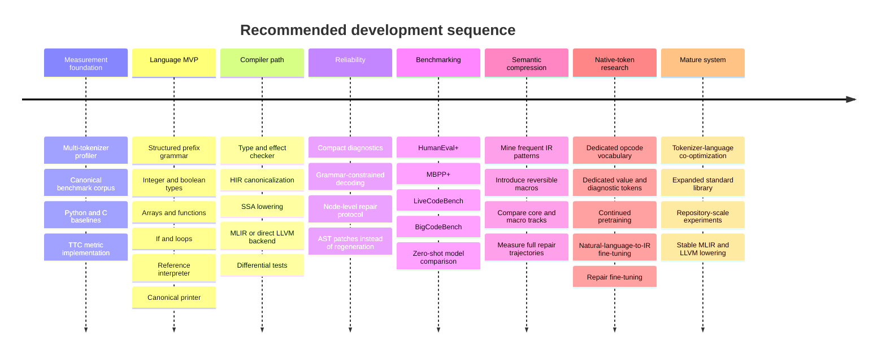

# Designing a Token-Minimal Programming Language or IR for LLM Code Generation

## Executive summary

As of **September 28, 2026**, the idea of optimizing a programming representation for *LLM generation cost rather than human readability* has moved from an interesting thought experiment into a small but credible research area. The strongest published evidence does **not** yet show that an entirely new language is universally superior to Python or C. It does show three things: syntax simplification can materially reduce generated tokens without sacrificing correctness; learned shorthand for recurrent code patterns can reduce generation further; and the target programming language can substantially change the total token consumption of coding agents because unfamiliar or verbose languages induce more invalid attempts and repairs. ShortCoder reports an 18.1% reduction from semantics-preserving Python syntax transformations and 18.1–37.8% improvements in generation efficiency; Token Sugar reports up to 15.1% source-token reduction and 11.2% generation-token reduction with near-identical Pass@1; the 2026 “Tokenmaxxing” study finds large, systematic language-dependent differences in full coding-agent trajectories. citeturn19academia40turn22search6turn22academia41

There are also experimental languages explicitly targeting agents or LLMs. **kernl** describes itself as AI-native and reports about 25% fewer tokens than Python and 40% fewer than Rust on its comparisons; **TEL** compacts C and translates back to conventional C; **NERD** explicitly describes itself as an LLM-native language; **GlyphLang** and **KARN** make similar agent-first claims. These results are useful design evidence, but their percentage claims are mostly project-defined and are not yet apples-to-apples academic benchmarks. citeturn0search1turn0search2turn4search1turn14search9turn14search17

A significant correction to my earlier answer is warranted: I could **not substantiate a primary source for the specific “Lingo” project I previously described**, nor could I substantiate the earlier claims I gave for a language called **toke/tokelang**. Searches located unrelated projects but not primary evidence matching those descriptions. Those two should therefore **not** be treated as established examples or used as quantitative baselines until a primary repository or paper is identified.

The central technical conclusion of this research is that **raw SSA is probably not the optimal language for the LLM itself to generate**. SSA is excellent *inside* a compiler because dependencies are explicit and optimization is convenient, and LLVM and MLIR are built around SSA-like representations. But explicit result names, block labels, branches and loop-carried values often add tokens. MLIR itself demonstrates a useful middle ground: structured regions and block arguments can represent high-level structure before progressively lowering it. citeturn21view0turn3search12

I therefore recommend a two-level architecture:

> **LLM → canonical structured prefix HIR → compiler-generated SSA → MLIR/LLVM → machine code**

The LLM-facing representation should be a **small, typed, canonical, fixed-arity, structured IR**. Expressions should use prefix operations so precedence and punctuation disappear. Types should normally be inferred and written only at interfaces or genuinely ambiguous operations. Variables should use compact local IDs. Structured `if`, loop and region constructs should avoid explicit CFG bookkeeping. There should be exactly one canonical spelling of every operation. The compiler—not the model—should introduce SSA temporaries, basic blocks, phi-equivalent block arguments and target-specific details.

For existing closed models, syntax should be selected by measuring the *actual provider tokenizer*. Short-looking glyphs are not reliably cheap. OpenAI's own tokenizer example shows that `2 + 2 = 4` is **five tokens** under `r50k_base`/`p50k_base` but **seven tokens** under `cl100k_base`/`o200k_base`, because newer encodings separate some spaces. citeturn24view1 Mistral likewise reports that its Tekken tokenizer is roughly 30% more efficient on source code than the SentencePiece tokenizer used by earlier Mistral models. citeturn23view1 Anthropic currently warns that Claude 4.7 and later use a newer tokenizer under which the same input produces approximately 30% more tokens than on earlier Claude models. citeturn23view2 A “token-efficient language” therefore has no tokenizer-independent token count.

For an open model that you can retrain, the more radical approach is stronger: **make language operations actual vocabulary tokens**. `<ADD>`, `<RET>`, `<LOOP>`, `<I32>`, common diagnostic codes, small value IDs, and perhaps selected semantic macros can each occupy one model token. At that point the textual spelling is merely a debugging visualization. The model effectively generates a serialized compiler IR directly. The catch is that those new vocabulary entries have no useful semantics until continued training or fine-tuning teaches the model how to use them.

The primary metric should therefore not be:

\[
\min T_{\text{source}}
\]

but something closer to:

\[
\boxed{
\min\;\mathbb{E}[\text{generated tokens until the first semantically correct program}]
}
\]

with parse failure, compilation failure, repair rounds and unsolved tasks measured separately. This is the quantity I would call **Tokens to Correct Program, TTC**.

| Design decision | Recommended starting choice |
|---|---|
| LLM-facing abstraction | Structured typed HIR, not LLVM IR |
| Expression representation | Fixed-arity prefix |
| Control flow | Structured regions/loops |
| Internal compiler representation | SSA |
| Names | Function-local numeric IDs; semantic names kept in metadata |
| Types | Explicit at boundaries, inferred internally |
| Syntax variants | None; one canonical representation |
| Existing closed models | ASCII compatibility profile optimized across provider tokenizers |
| Open-weight trained model | Native vocabulary-token profile |
| Repeated idioms | Optional mined semantic macros, evaluated separately |
| Repairs | AST/node patches, not full-program regeneration |
| Compiler diagnostics | Tiny typed error protocol |
| Primary benchmark objective | Tokens to Correct Program, not source length |
| Backend | Structured HIR → MLIR dialect → LLVM, or direct LLVM for the earliest prototype |

The remaining open variables should be treated explicitly rather than guessed: the exact OpenAI/Claude/Llama/Mistral model versions to target; whether changing the tokenizer is permissible; whether the language targets algorithms only or systems/API-heavy software; whether memory safety is required; whether standard-library macros count as part of the representation; and whether the objective is output-token latency, monetary API cost, total input+output traffic, or some weighted combination of all three.

## Research landscape

The field divides naturally into **syntax reduction**, **semantic shorthand**, **new agent-oriented languages**, and **whole-agent trajectory analysis**.

| Work/project | Form | Main idea | Reported result | Evidentiary status |
|---|---|---|---|---|
| **ShortCoder** | 2026 research paper | Ten semantics-preserving Python syntax simplifications plus training for conciseness | 18.1% syntax-level token reduction; 18.1–37.8% generation-efficiency improvement while preserving generation performance | Strongest directly relevant academic evidence. citeturn19academia40 |
| **Token Sugar** | 2025 research paper | Mine frequent, token-expensive code patterns and replace them with reversible shorthand | 799 sugar pairs; up to 15.1% source reduction and 11.2% generated-token reduction; near-identical Pass@1 | Strong evidence for semantic macro/token design. citeturn22search2turn22search6 |
| **Tokenmaxxing** | 2026 research paper | Compare complete coding-agent behavior by target programming language | Finds substantial cross-language token differences and traces overhead to invalid attempts, revisions and unfamiliar-language behavior | Particularly important because it measures trajectories rather than source length alone. citeturn22academia41 |
| **kernl** | Experimental language | Agent-first syntax, flat structure, compact constructs | Project reports ~25% fewer tokens than Python and ~40% fewer than Rust | Self-reported project benchmark; promising but needs independent replication. citeturn0search1turn0search5 |
| **TEL** | Experimental C-oriented language/transpiler | Compact representation that translates to standard C | Author demonstrates roughly 70% reduction on its small examples, including Hello World | Useful compiler prototype; comparisons are not standardized benchmark results. citeturn0search2 |
| **NERD** | Experimental LLM-native language | Machine-oriented vocabulary and compact operations; native compiler | Site reports 50–70% reductions; its recipe documentation gives a two-line addition example as eight tokens | Interesting design case, still primarily self-reported. citeturn4search1turn4search9 |
| **GlyphLang** | AI-first backend language | Reduce web/backend framework boilerplate and compile/generate conventional backend code | Project publishes token comparisons against conventional frameworks | More domain-specific than a general compiler IR. citeturn14search9 |
| **KARN** | Agent-oriented language | Dense representation explicitly targeting AI agents | Project reports reductions of 76% vs Python, 83% vs TypeScript and 89% vs Rust in its examples | Very aggressive self-reported figures; should be independently reproduced. citeturn14search17turn14search5 |
| **B-IR** | 2026 experimental design | Ask an LLM to design an LLM-oriented intermediate representation | Explores direct machine-oriented representation | Conceptual/prototyping evidence rather than controlled evaluation. citeturn0search35 |
| **Token-efficient-language proposal** | 2023 essay/prototype idea | Explicitly asks what a language designed around LLM token economics should look like | Early articulation of the design problem | Useful historical context, not experimental evidence. citeturn0search24 |
| **Lingo** | Unverified in this investigation | Earlier description could not be matched to a primary source | No result should presently be quoted | Exclude until a primary source is found |
| **toke/tokelang** | Unverified in this investigation | Earlier description could not be matched to a primary source | No result should presently be quoted | Exclude until a primary source is found |

The academically strongest result for your project may actually be **Token Sugar**, because its conclusion goes beyond “remove braces and shorten keywords.” It mines *repeated semantic/code patterns*, maps 799 of them to compact reversible representations, trains models on the transformed corpus, and obtains token savings while maintaining essentially the same Pass@1. That is direct evidence that an LLM can learn a compressed source codebook rather than merely tolerate shorter conventional syntax. citeturn22search2turn22search6

ShortCoder establishes the complementary point: even without inventing a wholly new language, canonical semantics-preserving transformations can reduce tokens substantially. It constructs ShorterCodeBench from validated original/simplified pairs and reports that models can be trained toward concision without abandoning correctness. citeturn19academia40

The Tokenmaxxing work changes the optimization target again. It compares five recent models across Python, Java, Rust and OCaml and finds that target language affects not merely the final solution length but the *agent trajectory*: models generate non-compiling solutions in less familiar languages, prototype in Python, continue revising already-correct code, and otherwise consume tokens because of language/model interaction. citeturn22academia41 This is why a four-token program that succeeds only 40% of the time can be worse than a twelve-token representation that succeeds 95% of the time.

That distinction gives a useful evidence hierarchy:

\[
\text{source length}
<
\text{tokenized source length}
<
\text{first-pass correct token cost}
<
\boxed{\text{full trajectory tokens to correctness}}
\]

Most experimental languages currently establish only one of the first two quantities. ShortCoder and Token Sugar go further by measuring generation performance, and Tokenmaxxing explicitly studies trajectories. citeturn19academia40turn22search6turn22academia41

An important implication is that your project does **not** need to beat every existing programming language in raw source density to be scientifically interesting. A much stronger claim would be:

> “At matched semantic correctness, our representation lowers median cumulative generated tokens to the first passing program by X%, while increasing or preserving first-pass compile and test success.”

That metric directly captures the intended benefit.

## Tokenization reality across model families

A programming language does not have an intrinsic LLM-token length. It has a length relative to a particular tokenizer, and often relative to a particular **version of a model**. OpenAI explicitly notes that encodings differ across model families, Mistral changed from SentencePiece to its Tekken tokenizer, Meta redesigned Llama's tokenizer for Llama 3, and Anthropic currently warns that newer Claude models use a tokenizer producing materially different counts. citeturn24view2turn16search19turn23view1turn23view2

### Major tokenizer profiles

| Model/family | Relevant tokenizer profile | What is known | Design consequence |
|---|---|---|---|
| **OpenAI GPT-2 / early GPT-3 lineage** | `r50k_base`, also called `gpt2` in OpenAI tooling | OpenAI's cookbook identifies `r50k_base`/GPT-2 as the older ~50k family. citeturn24view2 | Useful historical baseline; punctuation/whitespace behavior differs from newer encodings. |
| **OpenAI Codex lineage** | `p50k_base` | OpenAI lists it for Codex-era models and notes substantial overlap with `r50k_base`. citeturn24view2 | Good baseline for older code-oriented tokenization. |
| **GPT-3.5 / GPT-4-era models** | `cl100k_base` | OpenAI maps GPT-3.5/GPT-4-era models to `cl100k_base` in its archived cookbook. citeturn24view2 | Code spelling should be measured rather than inferred from GPT-2 behavior. |
| **GPT-4o-era family** | `o200k_base` | OpenAI maps GPT-4o/GPT-4o-mini to `o200k_base`; `tiktoken` is OpenAI's open-source BPE tokenizer implementation. citeturn24view2turn22search9 | Use `encoding_for_model()` or pin the exact encoding when benchmarking. |
| **Llama 3 family** | Meta's redesigned 128K-vocabulary tokenizer | Meta reports up to 15% fewer tokens than Llama 2 on its benchmarks. citeturn16search19 | Do not assume results obtained with older Llama tokenization carry over. |
| **Earlier Mistral family** | SentencePiece | Mistral explicitly describes its previous tokenizer as SentencePiece. citeturn23view1 | Conventional short ASCII syntax may split differently than under Tekken. |
| **Mistral NeMo / Tekken** | Tiktoken-based Tekken | Mistral says Tekken was trained on more than 100 languages and is about 30% more efficient at compressing source code than its preceding SentencePiece tokenizer. citeturn23view1 | An identical language can appear materially “better” solely because the tokenizer changed. |
| **Claude earlier generations** | Provider-managed tokenizer | Anthropic exposes token counting through its API rather than requiring clients to reproduce the tokenizer. citeturn23view2 | Treat the API's count as source of truth. |
| **Claude 4.7+** | Newer Anthropic tokenizer | Anthropic states that the same input produces approximately 30% more tokens than earlier Claude models, with workload-dependent variation. citeturn23view2 | Re-run token benchmarks against each target Claude model; do not cache historical counts. |
| **SentencePiece generally** | BPE or unigram subword model over raw text | SentencePiece is designed to learn fixed-size vocabularies directly from raw text without requiring conventional word tokenization. citeturn16search2turn16search8 | It is suitable for a custom open-model tokenizer, particularly when training corpus and code representation can be co-designed. |

OpenAI's `tiktoken` uses BPE and exposes both a direct encoding selector and `encoding_for_model()`. The official cookbook is itself marked archived, which is exactly why a benchmark should record the exact model ID, tokenizer library version and encoding rather than bake today's model-to-encoding mapping into the language design. citeturn22search9turn24view2

### Why visually compact syntax can lose

OpenAI provides an unusually useful example:

```text
2 + 2 = 4
```

Its official tokenizer comparison gives:

| Encoding | Token pieces | Count |
|---|---|---:|
| `r50k_base` | `["2", " +", " 2", " =", " 4"]` | 5 |
| `p50k_base` | `["2", " +", " 2", " =", " 4"]` | 5 |
| `cl100k_base` | `["2", " +", " ", "2", " =", " ", "4"]` | 7 |
| `o200k_base` | `["2", " +", " ", "2", " =", " ", "4"]` | 7 |

Those are the actual token byte boundaries published by OpenAI. citeturn24view1

Even a normal English word behaves differently across encodings. OpenAI's `antidisestablishmentarianism` example is five tokens under `r50k_base`/`p50k_base` and six under `cl100k_base`/`o200k_base`, with different internal segmentation. citeturn24view0

This means none of the following assumptions is safe:

```text
f     must be cheaper than function
r     must be cheaper than return
+     must be cheaper than add
{}    must be cheaper than end
λ     must be cheaper than fn
```

The correct operation is:

\[
\operatorname*{argmin}_{s \in \text{candidate spellings}}
\sum_m w_m T_m(s)
\]

where \(T_m(s)\) is the number of tokens that tokenizer \(m\) assigns to spelling \(s\). Then generation reliability must be measured on top of that.

For a language supporting several closed models, I would therefore build a **tokenizer Pareto optimizer**. Give it candidates such as:

```text
return
ret
r
R
!
->
```

and let it report their costs under every target encoding. Do this for every opcode, delimiter, type spelling and common sequence. The chosen spelling should not necessarily minimize tokens for one tokenizer; it should minimize a weighted cross-model objective while preserving generation accuracy.

### A reproducible tokenizer profiler

The OpenAI pieces can be inspected directly through `tiktoken`; Meta's Hugging Face model cards expose tokenizers for Llama checkpoints, while Mistral distributes tokenizer assets with its models; Anthropic's supported mechanism is its token-counting API. citeturn22search9turn16search9turn8search5turn23view2

A useful first repository script is therefore:

```python
# tools/token_profile.py
from __future__ import annotations

import json
import os
from typing import Any

SAMPLES = {
    "python_max": "def f(a,b):\n    return a if a>b else b",
    "c_max": "int f(int a,int b){return a>b?a:b;}",
    "candidate": "f 0 a:i b:i>i\n0 gt a b\n1 sel 0 a b\nr 1\ne",
    "prefix": "r sel gt a b a b",
}


def openai_profiles(text: str) -> dict[str, Any]:
    import tiktoken

    result = {}
    for name in ("r50k_base", "p50k_base", "cl100k_base", "o200k_base"):
        enc = tiktoken.get_encoding(name)
        ids = enc.encode(text)
        result[name] = {
            "count": len(ids),
            "ids": ids,
            "pieces": [
                enc.decode_single_token_bytes(i).decode("utf-8", errors="backslashreplace")
                for i in ids
            ],
        }
    return result


def hf_profile(repo: str, text: str) -> dict[str, Any]:
    from transformers import AutoTokenizer

    tok = AutoTokenizer.from_pretrained(repo, trust_remote_code=True)
    ids = tok.encode(text, add_special_tokens=False)

    return {
        "count": len(ids),
        "ids": ids,
        "pieces": tok.convert_ids_to_tokens(ids),
    }


def claude_message_count(text: str) -> int | None:
    """
    Claude's public API provides message token counts.
    This is a message-level count, not a dump of proprietary token pieces.
    """
    model = os.getenv("CLAUDE_MODEL")
    if not model:
        return None

    import anthropic

    client = anthropic.Anthropic()
    response = client.messages.count_tokens(
        model=model,
        messages=[{"role": "user", "content": text}],
    )
    return response.input_tokens


def main() -> None:
    hf_models = {
        # Pin exact revisions in a serious benchmark.
        "llama3": "meta-llama/Meta-Llama-3-8B",
        "mistral_nemo": "mistralai/Mistral-Nemo-Instruct-2407",
    }

    report: dict[str, Any] = {}

    for sample_name, text in SAMPLES.items():
        row: dict[str, Any] = {
            "bytes": len(text.encode("utf-8")),
            "openai": openai_profiles(text),
        }

        for name, repo in hf_models.items():
            try:
                row[name] = hf_profile(repo, text)
            except Exception as exc:
                row[name] = {"error": str(exc)}

        try:
            row["claude_message_tokens"] = claude_message_count(text)
        except Exception as exc:
            row["claude_message_tokens"] = {"error": str(exc)}

        report[sample_name] = row

    with open("token-profile.json", "w", encoding="utf-8") as f:
        json.dump(report, f, indent=2, ensure_ascii=False)

    print(json.dumps(report, indent=2, ensure_ascii=False))


if __name__ == "__main__":
    main()
```

The crucial methodological point is that Claude's count is a *message-level* API count and may include provider formatting, whereas `tiktoken.encode()` above measures the raw source string. Anthropic also states that its token-counting endpoint is an estimate and can differ slightly from actual message usage; final experiments should therefore retain API-reported usage as well. citeturn23view2

For publication-quality comparisons, store the raw output as:

```json
{
  "model": "...exact model id...",
  "tokenizer": "...exact tokenizer/revision...",
  "representation": "python|c|sir-text|sir-native",
  "sample_sha256": "...",
  "source_bytes": 44,
  "source_tokens": 21,
  "token_ids": [],
  "token_pieces": []
}
```

That prevents a future tokenizer update from silently invalidating the measurements.

## Candidate language and IR designs

The key design question is **where on the abstraction ladder the LLM should operate**.

LLVM IR is type-aware and SSA-based, but it was not designed for minimum generative length. MLIR deliberately supports high-level operations, nested regions, blocks and progressive lowering, and its block-argument model can encode control-dependent SSA values without explicit LLVM-style phi instructions. citeturn21view0 That architecture suggests that the LLM should generate something *above* low-level SSA and let the compiler synthesize the tedious structure.

### Why raw SSA is not the default winner

Consider a sum.

Python:

```python
def sum_array(a):
    s = 0
    for x in a:
        s += x
    return s
```

A conventional SSA-like form must make loop-carried state explicit:

```text
f sum a:[i]>i
b0(i=0,s=0)
0=lt i,len(a)
br 0 b1 b2
b1
1=get a i
2=add s 1
3=add i 1
br b0(3,2)
b2
ret s
```

The dependency structure is excellent for a compiler, but the model has now generated:

- block identifiers;
- several result identifiers;
- an explicit conditional branch;
- the loop backedge;
- loop-carried arguments;
- the increment;
- more operand references.

MLIR uses block arguments specifically to simplify some of the special cases associated with phi-node SSA, and its region hierarchy permits progressively higher-level representations before lowering. citeturn21view0

A compact **structured HIR** can instead say:

```text
f 0 a:ai>i
0 c0
L 1 a
0 add 0 1
E
R 0
E
```

Here:

```text
f  function
ai array<i32>
i  i32
c0 integer constant zero
L  foreach
E  end region
R  return
```

`0` and `1` are local slots, not SSA values. The compiler lowers the loop accumulator into SSA/block arguments later.

That representation sacrifices some human clarity but saves the LLM from spelling compiler bookkeeping.

### Prefix expressions are even more attractive

For expression trees, explicit temporaries are usually unnecessary.

Python:

```python
return a if a > b else b
```

Explicit SSA:

```text
0 gt a b
1 sel 0 a b
r 1
```

Fixed-arity prefix:

```text
r sel gt a b a b
```

The grammar already knows:

```text
gt  : value value -> bool
sel : bool value value -> value
r   : value -> terminator
```

Therefore no parentheses, commas, operator precedence or temporary IDs are necessary.

Likewise:

```c
return a + b * c;
```

can become:

```text
r add a mul b c
```

The parse is unique because `add` and `mul` have fixed arity:

```text
r
└── add
    ├── a
    └── mul
        ├── b
        └── c
```

That is likely a better LLM-facing representation than either infix syntax or full SSA.

### Four useful candidate architectures

| Candidate | Example | Main advantage | Main weakness | Recommendation |
|---|---|---|---|---|
| **Compact SSA** | `0=mul b c;1=add a 0;r 1` | Explicit dependencies; direct compiler mapping | Temporaries and CFG inflate generation, especially loops | Keep as an experimental baseline |
| **Structured prefix HIR** | `r add a mul b c` | No precedence, parentheses or temporaries; deterministic | Compiler does more lowering | **Best initial design** |
| **Stack/RPN IR** | `a b c mul add r` | Extremely little syntax | Stack bookkeeping is less local and edits can destabilize later code | Benchmark, but do not make the default initially |
| **Native model-token IR** | `<A0><A1><A2><MUL><ADD><RET>` | Each operation/reference can be exactly one model token | Requires tokenizer/model modification and training | **Best long-term compression target** |

The **structured prefix HIR** gives the most favorable starting tradeoff. It remains tree-shaped enough for LLM reasoning, removes conventional syntax overhead, and can deterministically lower into SSA.

### A concrete candidate grammar

A minimal grammar can deliberately make nearly every opcode fixed-arity:

```ebnf
program    := function*

function   := F function_id signature region E

signature  := parameter* GT type
parameter  := local_id COLON type

region     := statement*

statement  := assignment
            | if_stmt
            | loop_stmt
            | store_stmt
            | return_stmt

assignment := local_id operation

operation  := CONST literal
            | ADD value value
            | SUB value value
            | MUL value value
            | DIV value value
            | EQ  value value
            | LT  value value
            | SEL value value value
            | GET value value
            | CALL function_id value*

if_stmt    := IF value region E
            | IF value region ELSE region E

loop_stmt  := LOOP local_id value region E

store_stmt := SET value value value

return_stmt := RET value
```

The readable names above are specification names. The compatibility syntax may select shorter spellings after tokenizer benchmarking:

```text
f 0 a:ai>i
0 c 0
L 1 a
0 a 0 1
E
r 0
E
```

There should be **no aliases**. For example, do not support all of:

```text
a+b
add(a,b)
a add b
ADD a b
sum(a,b)
```

Choose exactly one representation.

This implements:

\[
\boxed{\text{one semantic primitive}\;\rightarrow\;\text{one canonical token sequence}}
\]

which reduces both source length and target-distribution entropy.

### Structured identifiers

Long descriptive identifiers are useful to humans and sometimes help the model reason, but there is no reason they must appear repeatedly in generated executable code.

Instead of:

```text
customer_account_balance
customer_account_balance
customer_account_balance
```

use a symbol table supplied in the input:

```text
0 customer_account_balance
1 transaction_amount
```

and output only:

```text
2 sub 0 1
r 2
```

A native tokenizer can reserve the most common local IDs as one token each:

```text
<V0>
<V1>
...
<V255>
```

or avoid the textual `V` completely because grammar position distinguishes a value reference from a literal.

The same trick applies to functions and types. Semantic names can stay in prompt metadata or debugging output while the generated representation uses small IDs.

### Types without type-token explosion

Static typing is desirable because it moves errors from runtime tests to cheap compiler rejection, but repeatedly spelling types is wasteful.

Rather than LLVM-like:

```text
%3 = add i32 %1, %2
%4 = mul i32 %3, %2
```

prefer:

```text
3 add 1 2
4 mul 3 2
```

because the compiler already knows from the function arguments and opcode constraints that the values are `i32`.

Only boundaries and ambiguity need annotations:

```text
f 0 0:i 1:i >i
```

The compiler should infer the rest.

This produces a useful division of labor:

\[
\text{static semantics} \neq \text{repeated static syntax}
\]

You want strong types but few generated type tokens.

### Native model tokens

If you control an open-weight model, the true endpoint is not really a textual programming language.

Suppose this display:

```text
<F><I32><I32><I32>
<GT><A0><A1>
<SEL><V0><A0><A1>
<RET><V1>
<END>
```

corresponds directly to vocabulary entries.

Then the actual generated sequence is:

```text
<F>
<I32>
<I32>
<I32>
<GT>
<A0>
<A1>
<SEL>
<V0>
<A0>
<A1>
<RET>
<V1>
<END>
```

That is **14 model tokens by construction** if every displayed item is a dedicated vocabulary item.

The display strings are irrelevant. `<GT>` could be visually 4 characters or 40 characters because it is a single vocabulary ID.

For:

```text
return select(a > b, a, b)
```

the body can be:

```text
<GT> <A0> <A1>
<SEL> <V0> <A0> <A1>
<RET> <V1>
```

or nine tokens.

With tree-form expressions and no temporary:

```text
<RET> <SEL> <GT> <A0> <A1> <A0> <A1>
```

it becomes **seven**.

That suggests that, under a native tokenizer, **prefix tree syntax beats SSA on straight-line expressions**.

### Semantic macros change the game

Token Sugar's strongest lesson is that grammar compression eventually hits a ceiling; larger reductions come from assigning short codewords to *frequent semantic patterns*. Its authors mined 799 recurrent patterns and obtained additional generation savings while preserving Pass@1. citeturn22search2turn22search6

For example, the primitive representation:

```text
0 c0
L 1 a
0 add 0 1
E
r 0
```

could have a learned macro:

```text
r fold.add a
```

and a native tokenizer could reduce it conceptually to:

```text
<RET> <FOLD_ADD> <A0>
```

Three tokens.

However, this raises an evaluation problem. If a HumanEval task is “sum this list” and your IR has `<FOLD_ADD>`, while C has to spell the loop, you are benchmarking **library abstraction**, not merely language representation.

Therefore publish two tracks:

| Track | Allowed operations | Question answered |
|---|---|---|
| **Core IR** | Arithmetic, comparisons, indexing, structured control, calls, memory | Is the representation itself token-efficient? |
| **Macro IR** | Mined frequent operations such as reductions, parsing idioms, container patterns | How efficient can an agent-oriented semantic codebook become? |

Both are valid; conflating them is not.

### Planning estimates for representative code

The table below is deliberately labeled **planning estimate**, not experimental result. Exact provider-token counts depend on the tokenizer and should be generated with the profiler above. Byte counts and lexical structure are deterministic; BPE ranges are intentionally broad.

| Task/representation | Example | Bytes | Rough existing-BPE planning range | Native-token opportunity |
|---|---|---:|---:|---:|
| Python `max` | `def max2... return a if a>b else b` | ~54 | ~20–30 | N/A |
| Compact C `max` | `int max2(int a,int b){return a>b?a:b;}` | ~38 | ~18–28 | N/A |
| Structured HIR | `r sel gt a b a b` plus signature | ~25–40 | ~12–22 | ~7 body tokens |
| Compact SSA | `0 gt a b / 1 sel 0 a b / r 1` | ~25–45 | ~15–25 | ~9 body tokens |
| Python array sum | conventional five-line loop | ~67 | ~25–40 | N/A |
| Compact C array sum | compact indexed `for` loop | ~73 | ~30–50 | N/A |
| Structured HIR sum | accumulator + `foreach` | ~40–50 | ~18–30 | ~10–15 body tokens |
| Macro HIR sum | `r fold.add a` | ~12–20 | ~5–12 | 3 body tokens |

The most important number in that table is not the estimated BPE column. It is the difference between **seven native tokens for a prefix selection expression** and a much larger conventional source representation. That is the compression regime available only when language design, tokenizer design and model training are jointly optimized.

## Experimental methodology: measuring tokens to a correct program

The benchmark should be built before the language is heavily optimized. Otherwise it is very easy to optimize attractive examples and unintentionally make actual generation reliability worse.

### Define Tokens to Correct Program explicitly

For task \(i\), suppose the model makes attempts \(r=0,\ldots,k\).

Let:

- \(G_{ir}\) = generated program/patch tokens;
- \(D_{ir}\) = diagnostic tokens sent back to the model;
- \(P_{ir}\) = other prompt tokens introduced during repair;
- \(S_{ir}=1\) if that attempt passes the semantic oracle.

Define output-only Tokens to Correct Program:

\[
TTC^{out}_i =
\sum_{r=0}^{k_i} G_{ir},
\qquad
k_i=\min\{r:S_{ir}=1\}.
\]

This directly measures how much autoregressive code/repair generation was necessary.

For API cost and context efficiency, additionally report:

\[
TTC^{rt}_i =
\sum_{r=0}^{k_i}
\left(
G_{ir}+D_{ir}+P_{ir}
\right).
\]

A price-weighted version is:

\[
C_i =
c_{\text{out}}\sum_r G_{ir}
+
c_{\text{in}}\sum_r(D_{ir}+P_{ir}).
\]

Do **not** hide failures by calculating TTC only over successful tasks. Set a common repair/token budget \(B\), report **success@B**, and plot:

\[
P(\text{correct by cumulative token budget }t).
\]

A representation whose curve rises faster dominates another representation in the quantity you actually care about.

### Metrics to record

Every generation attempt should produce a record like:

```json
{
  "task": "HumanEval/42",
  "model": "exact-model-version",
  "representation": "sir-prefix",
  "attempt": 1,

  "generated_tokens": 37,
  "repair_tokens_cumulative": 12,
  "input_tokens": 921,

  "parse_ok": true,
  "typecheck_ok": true,
  "compile_ok": true,
  "tests_passed": 17,
  "tests_total": 17,
  "semantically_correct": true,

  "first_pass_correct": false,
  "rounds_to_correct": 2,
  "tokens_to_correct": 49,

  "compile_ms": 8.2,
  "run_ms": 0.43
}
```

From those raw records, publish at minimum:

| Metric | Why it matters |
|---|---|
| Generated source tokens | Basic compression |
| First-pass parse success | Grammar learnability |
| First-pass type/compile success | Representation reliability |
| First-pass semantic correctness | Most important one-shot quality measure |
| Repair tokens | Cost imposed by mistakes |
| Repair rounds | Operational latency |
| Total output TTC | Main language-efficiency metric |
| Total input+output TTC | API/context efficiency |
| Success at fixed token budgets | Prevents short-but-useless languages from looking good |
| Executable runtime/memory | Ensures representation compression did not imply bad generated algorithms |
| Compiler diagnostic tokens | Measures repair-protocol overhead |

The Tokenmaxxing paper strongly supports looking at the *trajectory*, not merely final code, because much of the cross-language cost they observe arises from failed compilation, revision behavior and other interactions before the final answer. citeturn22academia41

### Benchmark suite

Use several kinds of tasks because an IR can accidentally overfit a single programming style.

**HumanEval+ and MBPP+** are appropriate first-stage function-generation benchmarks. EvalPlus provides substantially expanded test suites—its project states roughly 80× more tests for HumanEval+ and 35× for MBPP+ compared with the original benchmark tests—which reduces the chance that a superficially plausible but incorrect implementation receives credit. citeturn17search2

**LiveCodeBench** should be the main algorithmic generalization benchmark. It continuously collects newer contest problems and explicitly evaluates more than straightforward generation, including self-repair and execution-related scenarios. That repair component is unusually well aligned with TTC evaluation. citeturn18search1turn18search5turn18search13

**BigCodeBench** adds more practical tasks with complex instructions and diverse function calls, making it useful once the language has a realistic standard library or FFI rather than only integer algorithms. citeturn18search2turn18search6turn18search10

A sensible experimental matrix is therefore:

| Stage | Dataset | What it stresses |
|---|---|---|
| Initial compiler work | Small hand-written differential suite | Parsing, types, control flow |
| Core generation | HumanEval+ | Functions and algorithms |
| Broader core generation | MBPP+ | Short diverse programming tasks |
| Fresh/generalization | LiveCodeBench | Harder algorithms, contamination resistance, repair |
| Library/API phase | BigCodeBench | Practical APIs and function composition |
| Agent phase | Repository-level tasks later | Patching and real software maintenance |

### Keep the comparison fair

Each task should have the same semantic contract and tests across representations. There should be two presentation modes.

**Whole-program mode** requires the model to emit the interface, types and body in every language.

**Body-only mode** supplies the required function signature to every language and asks the model only for implementation. This isolates representation efficiency from boilerplate such as Python `def`, C includes or IR function declarations.

That separation is particularly important if your compiler can inject metadata for free. If the IR's function name and signature come from the task harness, give Python and C equivalent scaffolding before comparing body lengths.

Likewise, publish core and macro tracks separately. `<SORT>`, `<JSON_PARSE>` and `<FOLD_ADD>` are legitimate language facilities, but giving the candidate language a one-token operation that has no comparable baseline facility changes what is being measured.

### Control model familiarity

Run at least two experimental regimes:

**Zero-shot compatibility regime:** no fine-tuning on your language. The model receives a concise specification and demonstrations. This tests whether the representation is intrinsically learnable by existing models.

**Trained regime:** fine-tune or continue training on the new representation. This tests the ceiling after the representation becomes part of the model's learned distribution.

Do not compare a heavily fine-tuned IR model against a zero-shot Python model and attribute the whole difference to syntax.

Within a regime, use paired tasks, identical generation budgets and identical correctness tests. Record exact model releases and sampling settings. With stochastic sampling, run repeated samples per task and bootstrap confidence intervals over tasks. A mixed-effects analysis with model and representation as fixed effects and task as a repeated/random effect is preferable to comparing only aggregate means.

### A minimal evaluation loop

A useful architecture is to make model invocation pluggable and keep compiler evaluation deterministic:

```python
from __future__ import annotations

from dataclasses import dataclass, asdict
from typing import Callable
import json
import time


@dataclass
class CompileResult:
    parse_ok: bool
    type_ok: bool
    compile_ok: bool
    tests_ok: bool
    diagnostic: str


@dataclass
class Trial:
    task: str
    attempt: int
    generated_tokens: int
    cumulative_generated_tokens: int
    parse_ok: bool
    type_ok: bool
    compile_ok: bool
    tests_ok: bool
    diagnostic_tokens: int
    elapsed_s: float


def run_task(
    *,
    task_id: str,
    initial_prompt: str,
    generate: Callable[[str], tuple[str, int]],
    evaluate: Callable[[str], CompileResult],
    count_tokens: Callable[[str], int],
    repair_prompt: Callable[[str, str, str], str],
    max_repairs: int = 3,
) -> list[Trial]:

    prompt = initial_prompt
    previous_program = ""
    total_generated = 0
    records: list[Trial] = []

    for attempt in range(max_repairs + 1):
        t0 = time.perf_counter()

        program_or_patch, output_tokens = generate(prompt)
        total_generated += output_tokens

        # In a patch-based protocol, replace this with apply_patch().
        program = program_or_patch

        result = evaluate(program)
        diagnostic_tokens = count_tokens(result.diagnostic)

        records.append(
            Trial(
                task=task_id,
                attempt=attempt,
                generated_tokens=output_tokens,
                cumulative_generated_tokens=total_generated,
                parse_ok=result.parse_ok,
                type_ok=result.type_ok,
                compile_ok=result.compile_ok,
                tests_ok=result.tests_ok,
                diagnostic_tokens=diagnostic_tokens,
                elapsed_s=time.perf_counter() - t0,
            )
        )

        if result.tests_ok:
            return records

        prompt = repair_prompt(
            previous_program or program,
            program,
            result.diagnostic,
        )
        previous_program = program

    return records


def save_jsonl(path: str, rows: list[Trial]) -> None:
    with open(path, "a", encoding="utf-8") as f:
        for row in rows:
            f.write(json.dumps(asdict(row)) + "\n")
```

A full harness should also store raw completions, API-reported token usage, model revision, compiler revision, test results and tokenizer revision. The important architectural property is that the same evaluator can run `python`, `c`, `sir-text`, `sir-native` and later variants without changing the success oracle.

## Practical implementation architecture

The most robust implementation is a deliberately **two-representation compiler**: the LLM-facing format is optimized for generation; the internal format is optimized for compilers.

MLIR is particularly suitable after the MVP because it explicitly supports operations, values, blocks and nested regions; dialects can introduce custom operations; and it is designed for progressive lowering from high-level graphs/operations toward target-specific code. citeturn21view0

```mermaid
flowchart LR
    A[Task specification<br/>tests + compact symbol table] --> B[LLM]

    B -->|compatibility text| C[Compact structured HIR]
    B -->|native vocabulary IDs| C

    C --> D[Streaming parser]
    D --> E[Type and effect checker]
    E --> F[Canonical HIR]

    F --> G[SSA construction]
    G --> H[MLIR dialect]
    H --> I[LLVM dialect / LLVM IR]
    I --> J[Native code or WASM]
    J --> K[Test oracle]

    D -->|compact syntax error| L[Diagnostic encoder]
    E -->|compact type error| L
    K -->|compact failing-test summary| L

    L --> M[AST patch request]
    M --> B
```



MLIR's model of hierarchical operations and regions is especially relevant here because your LLM syntax can keep structured loops and conditionals while the lowering pipeline converts them into explicit SSA/control flow later. citeturn21view0

### Compiler front end

Keep the first grammar very small:

```text
integer values
boolean values
optional float values
fixed-size / dynamic arrays
functions
calls
if
foreach / counted loop
local variables
load/store or indexing
return
```

Delay:

```text
objects
inheritance
exceptions
generics
macros visible to users
operator overloading
implicit numeric conversions
concurrency
reflection
preprocessor features
```

The important goal is not minimal *feature count forever*. It is creating a sufficiently small semantic core that every generated sequence has a clear meaning.

Because the grammar is tiny and most opcodes have fixed arity, a hand-written streaming parser is attractive. It also makes diagnostics extremely precise:

```text
E3 17
```

could mean:

```text
E3 = missing operand
17 = node/token position
```

while:

```text
E7 12 I S
```

could mean:

```text
E7 = type mismatch
12 = node
I  = expected i32
S  = received string
```

A human-facing diagnostic layer can expand that into prose, but there is no reason to feed the prose to an agent that already knows the diagnostic codebook.

### Make repairs structural, not textual

An overlooked source of token waste is regenerating a complete program because one expression is invalid.

Give canonical syntax nodes stable IDs:

```text
n0 ...
n1 ...
n2 ...
```

or maintain those IDs internally.

Suppose the compiler reports:

```text
E7 n18 I B
```

Instead of asking for the whole program again, ask the model to produce an AST patch:

```text
P n18 <new-expression>
```

or:

```text
R n18 n21 <replacement-subtree>
```

The compiler applies the patch and recompiles.

Then:

\[
TTC =
T_{\text{initial program}}
+
\sum T_{\text{small patches}}
\]

rather than:

\[
TTC =
T_{\text{program}}
+
T_{\text{program regenerated}}
+
T_{\text{program regenerated again}}
+\cdots
\]

This could plausibly matter more than shortening `return` to `r`, and it is exactly the kind of effect that a TTC benchmark would reveal.

### Compatibility tokenizer versus custom tokenizer

Build **two profiles against the same semantics**.

**Compatibility profile.** This is plain UTF-8 text designed for existing OpenAI, Claude, Llama and Mistral models. Choose each spelling by empirical tokenizer/model tests. Favor known ASCII pieces unless data says otherwise. Avoid assuming exotic Unicode is compact. OpenAI's own examples demonstrate that even whitespace boundaries vary by encoding. citeturn24view0turn24view1

**Native profile.** For an open model, define vocabulary entries such as:

```text
<FUNC>
<RET>
<IF>
<ELSE>
<LOOP>
<END>

<ADD_I>
<SUB_I>
<MUL_I>
<LT_I>
<EQ_I>
<GET>
<SET>

<I32>
<I64>
<F32>
<BOOL>

<V0> ... <V255>
<A0> ... <A31>

<E_TYPE>
<E_ARITY>
<E_UNDEF>
<E_REGION>
```

These should be ordinary learnable vocabulary units unless your model runtime has a specific reason to categorize them as control/special tokens. “Single-token keyword” is the important property; framework-level “special token” status is not.

A useful native tokenizer might devote only hundreds or a few thousand entries to compiler concepts. To illustrate scale, adding 1,024 learned vocabulary entries to a model with a 4,096-dimensional tied embedding matrix adds roughly:

\[
1024\times4096=4{,}194{,}304
\]

embedding parameters—small relative to a multi-billion-parameter model. The real cost is not the parameter count; it is teaching those embeddings and their interactions enough semantics to make generation reliable.

### Training strategy

Do not start by training from scratch.

The sequence I would use is:

**Canonical translation data.** Build deterministic converters from Python/C/reference ASTs into the new HIR. Every training example should have one canonical target, never several equivalent spellings.

**Natural-language-to-HIR supervised tuning.** Convert existing code-generation datasets into your representation and train the model to emit the canonical HIR directly.

**HIR completion.** Train on partially masked/truncated HIR so the model learns local syntax and semantics, not merely prompt-to-whole-program mapping.

**Compiler repair data.** Deliberately mutate valid programs to create undefined IDs, wrong operand types, incorrect arities, missing region terminators and similar errors. Pair compact diagnostics with the minimal correct patch.

**Round-trip training.** Include Python/C → HIR, HIR → conventional source and HIR → explanation tasks so that the model learns semantic correspondence.

**Native-token continued training.** Only after the textual semantics are stable should you introduce dedicated vocabulary entries and continue training on token-native code. Token Sugar provides direct evidence that models can learn token-efficient shorthand through training while retaining code-generation quality. citeturn22search6

**Token-aware optimization.** In later experiments, use an objective that rewards successful programs with fewer generated tokens but imposes a large penalty on semantic failure:

\[
R =
R_{\text{tests}}
-
\lambda T_{\text{output}}
-
\mu N_{\text{repairs}}.
\]

Correctness must dominate. Otherwise the trivial optimal program is an empty output.

### Constrained generation

Because the language has a tiny grammar, grammar-constrained decoding is especially attractive. After:

```text
r add
```

the decoder knows that exactly two values are required. After a conditional region begins, only operations legal in a region need remain available. A token-level grammar mask can therefore eliminate whole classes of parse errors by construction.

With a native tokenizer, this becomes particularly simple because grammar terminals correspond closely to model tokens.

The hierarchy then becomes:

```text
grammar constraint
    ↓ eliminates malformed syntax

static type/effect checker
    ↓ eliminates invalid semantics

compiler
    ↓ eliminates lowering/backend errors

tests
    ↓ detect behavioral errors
```

The LLM should spend its uncertainty budget on the **algorithm**, not on whether a comma, brace or type annotation is legal.

## Tradeoffs, recommendations, and prioritized roadmap

The largest conceptual mistake would be to optimize the language like a code-golf language. **Character minimization and LLM efficiency are different objectives.** OpenAI demonstrates that tiny formatting differences can change BPE token counts; Meta reports a tokenizer redesign alone reducing Llama 3 token use by up to 15% relative to Llama 2; Mistral reports roughly 30% better source-code compression from Tekken than its previous SentencePiece tokenizer; Anthropic's current tokenizer transition changes counts in the opposite direction by approximately 30% for the same input. citeturn24view1turn16search19turn23view1turn23view2

The second mistake would be to optimize token count while ignoring the model's learned prior. The Tokenmaxxing study shows that unfamiliar languages can provoke non-compiling solutions and extra revisions, while ShortCoder and Token Sugar show that training can recover or preserve generation quality when the representation is deliberately compressed. citeturn22academia41turn19academia40turn22search6

The practical tradeoffs are therefore:

| Optimization | Benefit | Risk | Best response |
|---|---|---|---|
| Short cryptic opcodes | Fewer lexical tokens | Existing model may not understand them | Empirically test spelling × success, not spelling alone |
| Raw SSA | Explicit dependencies | More value IDs/control-flow tokens | Keep SSA internal |
| Structured HIR | Short control flow | More compiler lowering work | Recommended |
| Prefix expressions | Removes precedence/punctuation | Less familiar to pretrained models | Fine-tune; compare zero-shot separately |
| Numeric IDs | Repeated names become cheap | Semantic names aid reasoning | Put names in metadata, IDs in generated stream |
| Type inference | Eliminates repeated annotations | Harder compiler front end | Worth it |
| Static types | Earlier error detection | Potential syntax overhead | Infer almost all local types |
| Semantic macros | Potentially enormous reductions | Can turn benchmark into “who has the best built-in” | Separate core and macro tracks |
| Custom tokenizer | True one-token operations | Requires open model and retraining | Long-term phase |
| Rare Unicode glyphs | Visually compact | Often tokenizes poorly and lacks training exposure | Avoid unless measurements prove otherwise |
| Compact diagnostics | Cheap repair loops | Model must know error codebook | Include diagnostic repair in training |
| AST patches | Very low repair output | More tooling complexity | High-priority experiment |
| One canonical syntax | Concentrates probability mass | Less expressive for humans | Exactly appropriate here |

My strongest architectural recommendation is therefore:

\[
\boxed{
\textbf{Structured prefix HIR externally; SSA internally; native tokens eventually.}
}
\]

A representative final LLM-facing textual profile might look like:

```text
f 0 0:ai>i
1 c0
L 2 0
1 add 1 2
E
r 1
E
```

while its native-token equivalent could conceptually be:

```text
<F><FN0><A0><ARR_I><RET_I>
<CONST0><V1>
<FOREACH><V2><A0>
<ADD_SET><V1><V2>
<END>
<RET><V1>
<END>
```

and the compiler could lower that into an SSA representation conceptually equivalent to:

```text
entry:
  br loop(0, 0)

loop(i, sum):
  cond = i < len(a)
  cond_br cond, body, exit

body:
  x = a[i]
  sum2 = sum + x
  i2 = i + 1
  br loop(i2, sum2)

exit:
  ret sum
```

That separation makes the LLM emit the shortest level of abstraction while preserving all the advantages of an SSA compiler backend. MLIR's architecture is well suited to exactly this kind of progressive lowering from structured/high-level operations to target-oriented IR. citeturn21view0

A second strong recommendation is to make **tokenizer optimization automated**. The compiler repository should contain a source file such as:

```yaml
operations:
  return:
    candidates: [return, ret, r, R]
  multiply:
    candidates: [multiply, mul, m, M, "*"]
  function:
    candidates: [function, func, fn, f, F]
```

and a benchmark should evaluate every candidate against:

```text
r50k_base
p50k_base
cl100k_base
o200k_base
target Llama tokenizer
target Mistral/Tekken tokenizer
target Claude model count endpoint
```

But the optimizer should also feed each candidate grammar to the actual models and measure compile/pass rates. The objective is something like:

\[
L(s)=
\sum_m w_m
\left[
T_m(s)
+
\lambda\,E_m(s)
\right],
\]

where \(E_m\) is empirical generation/repair cost rather than merely token length.

A third recommendation is to treat **repair protocol design as part of the language design**. Token-efficient code followed by enormous compiler errors and full rewrites is not an efficient LLM programming interface. The compiler and language together form a communications protocol.

The development sequence I would prioritize is:



The **MVP should deliberately not use a custom tokenizer**. That is important. First prove that the semantics and canonical structured representation outperform Python/C in TTC when generated as ordinary text by existing models. Otherwise a custom tokenizer creates two simultaneous experimental variables—representation and model retraining—and you will not know which one caused an improvement.

After the compatibility representation demonstrates a reduction in TTC, the native-token experiment becomes scientifically clean:

\[
\text{textual SIR}
\quad\longrightarrow\quad
\text{same SIR semantics + native vocabulary}
\]

so you can isolate the gain from tokenizer co-design.

The first research milestone worth targeting is therefore not “50% fewer characters.” It is a table resembling:

| Representation | First-pass compile | First-pass correct | Median initial tokens | Median repair tokens | Median TTC | Success@fixed budget |
|---|---:|---:|---:|---:|---:|---:|
| Python | baseline | baseline | baseline | baseline | baseline | baseline |
| C | measured | measured | measured | measured | measured | measured |
| Compact SSA | measured | measured | measured | measured | measured | measured |
| Structured prefix HIR | **measured** | **measured** | **measured** | **measured** | **measured** | **measured** |
| HIR + AST repair | measured | measured | measured | **measured** | **measured** | **measured** |
| HIR + semantic sugars | measured | measured | measured | measured | **measured** | measured |
| Native-token HIR | measured | measured | **measured** | measured | **measured** | measured |

ShortCoder and Token Sugar suggest that 10–20% reductions without losing correctness are already plausible through transformations alone, while the experimental language projects claim considerably larger reductions but have not yet established comparable cross-model TTC results. citeturn19academia40turn22search6turn0search1turn0search2turn4search1 The genuinely interesting result would therefore be not another self-reported “our Hello World has 70% fewer tokens,” but a controlled demonstration that a model-oriented IR shifts the **entire success-versus-token-budget curve**.

The strongest research hypothesis emerging from the current evidence is:

\[
\boxed{
\begin{aligned}
&\text{canonical structured prefix semantics}\\
+{}&\text{type inference}\\
+{}&\text{compact local IDs}\\
+{}&\text{compiler-generated SSA}\\
+{}&\text{grammar-constrained decoding}\\
+{}&\text{compact structural repair}\\
+{}&\text{learned semantic sugars}\\
+{}&\text{eventually, a co-designed tokenizer}
\end{aligned}
}
\]

should outperform merely inventing a code-golf syntax.

In other words, the most promising end state is not really a conventional “programming language for robots.” It is a **learned, typed compiler protocol whose symbols are aligned with the LLM's own output vocabulary**. Human-readable source becomes an optional debugging projection; the canonical artifact is a short semantic token stream. Existing work in 2025–2026 has established enough of the individual pieces—syntax reduction, learned shorthand, language-dependent trajectory cost and agent-first languages—to make a rigorous implementation and TTC benchmark a credible research project rather than a novelty. citeturn19academia40turn22search6turn22academia41