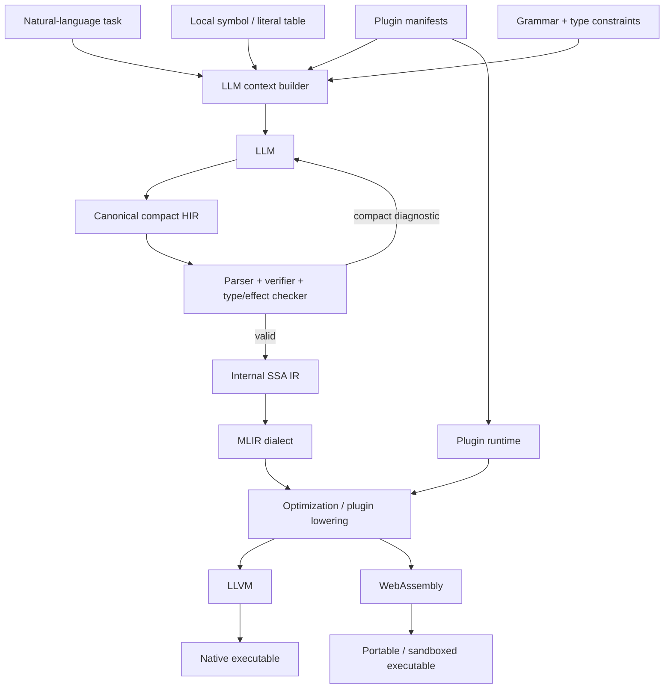
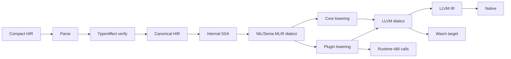
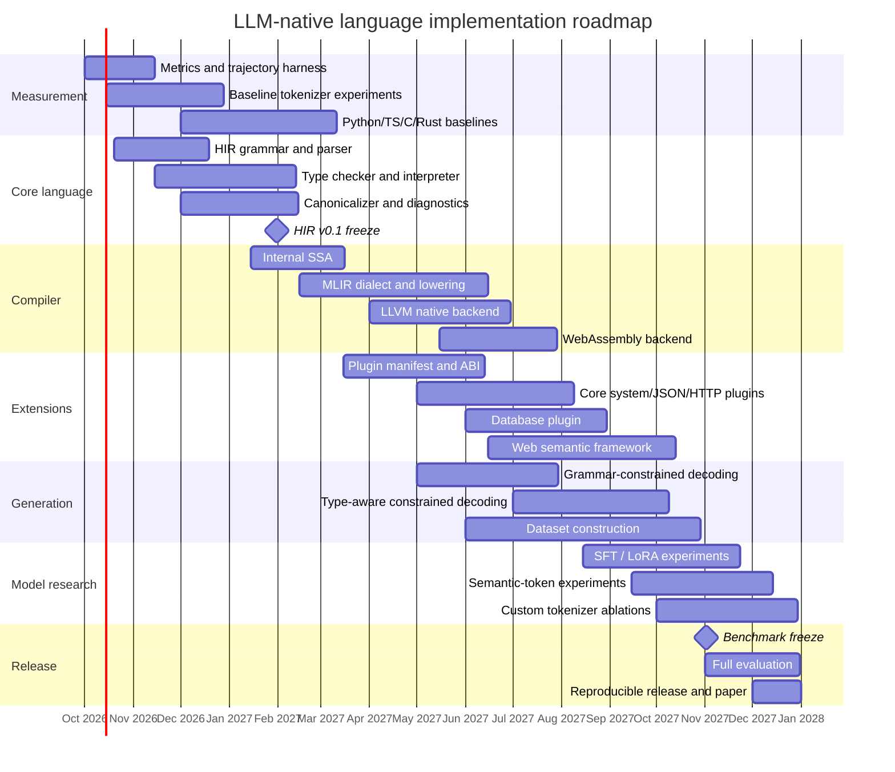

# Designing an LLM-Native, Token-Efficient Programming Language with Extensible Plugins

## Executive summary

The strongest design is **not** “make Python/Rust syntax shorter.” It is to build a **machine-oriented semantic instruction language** whose only important authors are LLMs and whose primary consumer is a compiler.

The most important conclusion from current work is that **final source-code token count is the wrong optimization target by itself**. Recent experiments on coding agents show that total trajectory cost can be dominated by reasoning, retries, revisions, and post-solution behavior rather than the final program length; a 2026 study across Python, Java, Rust, and OCaml found Python cheapest overall despite other languages sometimes having compact constructs, and explicitly found that final source length alone does not predict total agent token consumption well. citeturn19view6 Toke provides an especially useful cautionary result: its canonical v0.4 representation is smaller in raw bytes than paired Python in a tiny verified sample, yet costs **1.34× as many `cl100k_base` tokens as Python** on its 60-task comparison; its shipped custom 8K tokenizer also requires **15.4% more tokens** than `cl100k_base` on its current canonical corpus. citeturn20view0turn20view1

So I would optimize this:

\[
\boxed{
\text{TTCP} =
\text{all LLM output tokens until the first verified-correct program}
}
\]

and separately track input/context tokens:

\[
\boxed{
\text{TotalCostTokens}
=
T_\text{input}
+
T_\text{generation}
+
T_\text{repair}
}
\]

The language should minimize TTCP **subject to functional correctness and runtime-performance constraints**, rather than minimizing characters or final-source tokens.

My recommended architecture is:



The core recommendation is:

| Decision | Recommendation |
|---|---|
| Human readability | **Do not optimize for it** |
| Generated representation | Typed, canonical, structured HIR |
| Source-level SSA | **No**; use implicit-result HIR and create SSA internally |
| Variables | Dense numeric IDs; no descriptive local names |
| Syntax | Prefix/opcode form; no precedence, optional syntax, or synonyms |
| Core vocabulary | Approximately 40–100 fundamental semantic operations initially |
| Types | Static; result types usually inferred from opcode signatures |
| Control flow | Structured regions in generated HIR; CFG/phi/block args internally |
| Plugins | Fixed grammar, typed plugin operations, stable IDs, local dense aliases |
| Frameworks | Semantic operations/macros layered above plugins |
| Tokenizer initially | Exact existing tokenizer of each target model |
| Custom tokenizer | Only after the language and dataset are stable |
| Constrained decoding | Strongly recommended for open-weight inference |
| Backend | HIR → SSA → MLIR → LLVM; add Wasm as a second target |
| Compiler implementation | Rust frontend + MLIR/LLVM integration |
| Primary metric | Median tokens-to-correct-program |
| Secondary metrics | first-pass correctness, repair rounds, total input/output tokens, latency, compile time, runtime, memory, binary size |
| Evaluation baselines | Python, TypeScript, C, Rust |
| First useful plugins | `sys`, `json`, `http`, `db`; then a higher-level `web` framework |

There is **no meaningful absolute “lowest possible number of tokens.”** You could add an operation called `build_complete_shopify_clone` and produce an application in one token. That measures library abstraction, not language efficiency. Your benchmarks therefore need a **frozen core/plugin vocabulary** and must report results separately for:

1. **core-only programs**, and
2. **domain-semantic/plugin programs**.

That distinction is essential to making the project scientifically credible.

Existing work points in the same general direction but has not, so far, established a universally optimal design. Lingo explicitly minimizes LLM-generated tokens while retaining conventional language structure; kernl targets LLM authorship; TEL compresses C through a reversible surface form; NERD is explicitly machine-oriented; ShortCoder simplifies Python syntax; Token Sugar learns reversible shorthand; and Toke explores a language, tokenizer, model training, standard library, and web framework together. citeturn19view0turn19view1turn20view7turn20view6turn19view5turn19view7turn20view1

**If I were implementing this project today, I would not begin with a custom tokenizer.** I would first build a tiny canonical IR-language, measurement harness, interpreter, compact diagnostics, plugin ABI, and constrained generator. Once you have thousands of verified programs and actual TTCP measurements, then optimize lexical aliases; only later add model-specific semantic tokens and fine-tuning.

## Evidence and design implications

Several current projects are useful, but their results have to be interpreted carefully because their definitions of “token” and their evaluation methods differ.

| Project / work | Approach | Reported evidence | What you should take from it |
|---|---|---|---|
| **Lingo** | Conventional but concise language; HM-style inference, built-ins, ASCII syntax | Project targets 90–110 tokens per Rosetta task and claims ~40% fewer tokens than Python on structured examples | Type inference and removing imports/boilerplate are useful, but it remains largely human-language-like. citeturn19view0 |
| **kernl** | Flat AI-native language, named operators, verification constructs | Project reports 139 vs 185 Python vs 233 Rust units over five examples | Interesting syntax ideas, but its README states those counts use **whitespace/punctuation splitting**, not a deployed LLM tokenizer, so they are not sufficient evidence of LLM-token savings. citeturn19view1 |
| **TEL** | Reversible compact representation of C | Example reductions include 27→8 tokens for its Hello World example | Demonstrates boilerplate removal, implicit includes and canonical loop shorthand; still fundamentally source-code compression. citeturn20view7 |
| **NERD** | Intermediate language explicitly intended for machine authorship | Project reports sizeable reductions on FizzBuzz/math examples | Correctly questions whether human syntax should matter, but assumptions such as common words being one token are tokenizer-dependent. citeturn20view6turn18search6 |
| **ShortCoder** | AST-level simplification of Python plus model adaptation | Ten syntax transformations; reports about 18.1% syntax-level reduction and lower generated-token counts after adaptation | Canonical semantics-preserving simplification works without inventing an entirely new semantics. citeturn19view5 |
| **Token Sugar** | Reversible shorthand for frequent code patterns | Mines recurring token-expensive patterns and integrates shorthand into model training | Strong precedent for a small set of **semantic macros** rather than merely single-character keywords. citeturn19view7 |
| **Toke** | Language + tokenizer + training + stdlib/framework experiments | Current v0.4 costs 1.34× Python under `cl100k_base`; its current custom 8K tokenizer is 15.4% worse than `cl100k_base` on canonical v0.4 text | Extremely important negative result: custom syntax/tokenizers can make things worse; measurement must use the exact tokenizer and functional tests. citeturn20view0turn20view1 |
| **Tokenmaxxing study** | Full coding-agent trajectories across languages | Finds substantial language effects, but final code length does not by itself explain total output-token cost | Optimize the **whole generate/compile/test/repair trajectory**, not only the final file. citeturn19view6 |

Two conclusions follow.

First, **character density and token density are different objectives**. OpenAI's documentation explicitly notes that token boundaries vary with model/encoding and that punctuation, spaces, word fragments, and complete words can all become tokens; `tiktoken` is a BPE implementation and exposes model-specific encodings for this reason. citeturn18search6turn17view0 A spelling that is optimal for one tokenizer need not be optimal for another.

Second, **syntactic validity is much easier than semantic correctness**. Toke reports a configuration reaching 100% compilation Pass@1 on a curated set but only 55.6% functional correctness there; its broader corpus results are weaker still. Its language deliberately has a small bounded-lookahead grammar and machine-readable diagnostics, yet that alone does not solve program synthesis. citeturn20view0 That is precisely why your benchmark's primary endpoint needs to be hidden-test correctness, not parsing or compilation success.

The 2026 ShortCoder work provides evidence for a less radical intermediate path: syntax-preserving transformations can reduce generation length, and model adaptation can produce more concise programs. citeturn19view5 Token Sugar likewise suggests that frequently recurring, reversible patterns can be worth representing directly. citeturn19view7 Together, those results strongly motivate **semantic compression**.

That means:

```text
bad optimization:

return_statement -> r
```

is useful but small.

This is much more powerful:

```text
HTTP route + parameter extraction + DB lookup + 404 handling
        ↓
one typed semantic web operation / macro
```

The second moves predictable work from probabilistic generation into deterministic compiler/plugin code.

That observation also gives you a way to define a fair research question:

> For a fixed compiler version, fixed core vocabulary, fixed plugin set, fixed model, and fixed task set, what representation minimizes the median total number of tokens required to reach a program that passes all hidden tests?

That is measurable and difficult to game.

I would publish **three independent efficiency results**, not a single percentage:

\[
R_\text{source} =
\frac{T_\text{final language}}
     {T_\text{baseline final source}}
\]

\[
R_\text{TTCP} =
\frac{T_\text{until first correct language}}
     {T_\text{until first correct baseline}}
\]

\[
R_\text{context} =
\frac{T_\text{language/plugin context}}
     {T_\text{baseline framework context}}
\]

The second is the main result. The first describes representation density. The third prevents a misleading result where you save 50 output tokens by injecting 4,000 tokens of plugin documentation.

A useful success criterion for the project would therefore be something like:

> **At equal or better hidden-test success, reduce median output TTCP by at least 30% relative to Python and TypeScript, while keeping input+output total tokens lower and native runtime within a predefined performance envelope.**

The 30% figure is a project target, not a claim that existing research proves it is attainable.

## Core language and canonical representation

I would make the generated language a **typed structured HIR**, not a conventional source language and not raw LLVM-like SSA.

MLIR demonstrates why SSA is excellent internally: it represents programs as operations producing typed values, organized into blocks and regions, and is designed to progressively lower high-level structures toward target-specific representations. citeturn20view8 But making an LLM explicitly spell every SSA destination wastes tokens:

```text
%17 = mul %3, %9
%18 = add %17, %5
%19 = cmp %18, %12
```

The compiler can generate `%17`, `%18`, and `%19` itself.

I therefore recommend this distinction:

```text
LLM output:
    structured canonical HIR
           ↓
compiler assigns value IDs / blocks
           ↓
typed SSA
           ↓
MLIR
```

A minimal generated program could look approximately like this:

```text
F 0 i i>i
A 0 1
R 2
E
```

For illustration:

```text
F = function
A = integer add
R = return
E = end
i = i64
```

Arguments are values `0` and `1`. Because `A` produces one result, the compiler deterministically assigns the next value ID, `2`. The LLM therefore does **not** have to generate:

```text
v2=
```

at all.

The readable projection could be:

```text
fn add(a: i64, b: i64) -> i64 {
    return a + b
}
```

and an internal SSA projection:

```text
func @0(%0: i64, %1: i64) -> i64 {
    %2 = addi %0, %1
    return %2
}
```

All three are the same program. Only the first is generated by the model.

**The core should be deliberately boring.** A plausible v0 instruction taxonomy is:

| Category | Initial semantic operations |
|---|---|
| Module/function | function, call, return |
| Constants | integer, float, bool, string, null |
| Integer arithmetic | add, sub, mul, div, rem, neg |
| Float arithmetic | add, sub, mul, div |
| Comparison | eq, ne, lt, le, gt, ge |
| Boolean | and, or, not |
| Aggregate | tuple/struct construct, get |
| Collections | array construct, index, length |
| Control | if-region, loop-region, break, continue |
| Memory | alloc, load, store, address/reference |
| Conversion | explicit numeric/reference conversions |
| Plugin boundary | plugin operation |
| Error/result | result construct/test/unwrap or a very small equivalent |
| Intrinsics | panic/assert only if necessary |

Do **not** initially include classes, inheritance, macros, exceptions, operator overloading, user-defined operators, implicit casts, multiple loop syntaxes, pattern-syntax alternatives, annotations, reflection, or metaprogramming.

The principle should be:

\[
\boxed{
\text{one semantic operation}
\rightarrow
\text{one canonical representation}
}
\]

C++ allows:

```cpp
i++;
++i;
i += 1;
i = i + 1;
```

Your generated representation should have one canonical operation.

Likewise, there should be no distinction between:

```text
a+b
add(a,b)
a.add(b)
```

at the generated level.

This decreases output entropy: the model does not have to distribute probability across several equivalent surface forms.

**Do not bake the spelling of opcodes into the semantic specification.** Make the semantic instruction ID stable, but make its textual alias a model profile.

For example:

```toml
# semantic identity
opcode = 3
name = "iadd"
signature = "(i64,i64)->i64"

# GPT-profile surface
surface = "add"
```

A different profile might discover empirically that:

```text
A
```

is cheaper and equally reliable.

This lets your optimizer search over:

```text
add
a
A
+
iadd
sum
```

without changing the language semantics.

That is considerably better than deciding by intuition that `+` or `A` “must” be cheaper. OpenAI explicitly provides model-specific tokenization because tokenization depends on the encoding/model. citeturn17view0turn18search6

**Use positional/numeric value IDs, not names.**

Bad for this application:

```text
customerAccountBalance
currentCustomer
databaseConnection
```

Preferred:

```text
0
1
2
```

Function arguments receive IDs `0..n-1`, and result-producing instructions allocate subsequent IDs implicitly.

For top-level entities, maintain an environment:

```text
f0 = load_user
f1 = send_email
t0 = User
p0 = web
p1 = db
s0 = "/users/:id"
```

But ideally that mapping is supplied as **input context** to the LLM and is not repeated in generated code.

The model can output:

```text
X 1 3 0
```

instead of:

```text
database.find_user_by_id(user_id)
```

where `X` means extension/plugin call, `1` is the local plugin ID, `3` is the operation ID, and `0` identifies an argument value.

**Strings deserve special treatment.** Application strings can dominate token cost. Add a per-generation literal table so strings already present in the task can be referenced rather than reproduced:

```text
s0 "/users/:id"
s1 "not found"
```

Then the generated program references `s0`/`s1`. When a new literal must be invented, the model emits it once and subsequent occurrences become IDs.

For control flow, I would generate **structured regions rather than CFG blocks**:

```text
I 0
  ...
L
  ...
E
```

where:

```text
I = if
L = else
E = end
```

and lower this into SSA blocks internally. Explicit block labels and phi-node wiring are valuable to a compiler but mostly unnecessary output burden for an LLM.

You should empirically compare this with a length-prefixed representation:

```text
I 0 3 2 ...
```

but I expect explicit region termination to be more model-reliable because asking an autoregressive model to calculate exact instruction counts creates another failure mode. That expectation is a hypothesis for your benchmark, not something to assume.

**Canonicalization should happen immediately.** A formatter is not merely cosmetic: it is the language normalizer.

For any valid program:

\[
\operatorname{canon}(\operatorname{canon}(P))
=
\operatorname{canon}(P)
\]

and semantically equivalent frontend spellings should map to exactly the same canonical HIR where practical.

A strong v0 grammar can be close to this:

```ebnf
module      := function*
function    := FN id signature NL block END NL
block       := instruction*
instruction := core_op operand* NL
             | plugin_op operand* NL
             | IF value NL block (ELSE NL block)? END NL
             | LOOP operands NL block END NL
operand     := value_id | literal_id | immediate
```

Notice what is absent:

```text
commas
semicolons
parentheses around ordinary calls
operator precedence
local declarations
destination assignments
optional terminators
comments
formatting choices
```

Operation arity and operand types come from the opcode schema, so the parser often does not need delimiters.

Here is a prototype parser shape in Rust:

```rust
use std::str::FromStr;

#[derive(Debug)]
enum Inst {
    Add(u32, u32),
    Sub(u32, u32),
    Call { fun: u32, args: Vec<u32> },
    Ret(u32),
}

fn id(s: &str) -> Result<u32, String> {
    u32::from_str(s).map_err(|_| format!("bad value id: {s}"))
}

fn parse_line(line: &str) -> Result<Inst, String> {
    let mut p = line.split_ascii_whitespace();

    let op = p.next().ok_or("empty instruction")?;

    match op {
        "A" => {
            let a = id(p.next().ok_or("A missing lhs")?)?;
            let b = id(p.next().ok_or("A missing rhs")?)?;
            if p.next().is_some() {
                return Err("A has too many operands".into());
            }
            Ok(Inst::Add(a, b))
        }

        "S" => {
            let a = id(p.next().ok_or("S missing lhs")?)?;
            let b = id(p.next().ok_or("S missing rhs")?)?;
            Ok(Inst::Sub(a, b))
        }

        "C" => {
            let fun = id(p.next().ok_or("C missing function")?)?;
            let args = p.map(id).collect::<Result<Vec<_>, _>>()?;
            Ok(Inst::Call { fun, args })
        }

        "R" => {
            let value = id(p.next().ok_or("R missing value")?)?;
            Ok(Inst::Ret(value))
        }

        _ => Err(format!("unknown opcode: {op}")),
    }
}
```

Do not over-engineer the parser. The language's grammar should be simple enough that a handwritten parser is almost trivial.

**Diagnostics should also have two projections.** Toke's use of stable error codes, spans and machine-readable fix information is exactly the right direction for an AI-oriented compiler. citeturn20view0

Human diagnostic:

```text
error E231:
argument 1 to db.get_user expected i64 but received str
at instruction 17, operand 2
suggested repair: parse_i64(value 8)
```

LLM wire diagnostic:

```text
231 17 2 i s 8 4
```

with a schema supplied once:

```text
231 = type mismatch
i   = i64
s   = str
4   = parse_i64
```

The repair loop should not make the model reread a paragraph of English after every compiler failure.

Finally, provide a compact binary serialization, but **do not confuse binary size with generation-token efficiency**.

For the earlier function, a binary representation might conceptually be:

```text
01 00 02 01 01 01
10 00 01
20 02
FF
```

or, using varints:

```text
FN, 0, argc=2, I64, I64, I64,
IADD, 0, 1,
RET, 2,
END
```

MLIR itself separates human-readable textual, in-memory, and compact serialized representations of the same semantic structure, providing a good precedent for this separation. citeturn20view8

Your binary form is useful for cache/storage/network transport. It only saves LLM generation tokens if you eventually control decoding strongly enough for the model to emit corresponding semantic token IDs directly.

## Tokenizer and decoding strategy

Tokenizer design should be staged because **changing the tokenizer and changing the programming representation are different experiments**.

OpenAI's `tiktoken` is BPE-based, exposes model-specific encodings, and can also construct custom encodings with additional special tokens. citeturn17view0 SentencePiece can train fixed-vocabulary BPE or unigram tokenizers directly from raw text. citeturn17view1turn15academia36 Meta's Llama repositories likewise ship/use model tokenizer artifacts, which is why Llama experiments should be tied to the exact tokenizer version corresponding to the tested model rather than to an abstract “Llama tokenizer.” citeturn17view2

### Tokenizer alternatives

| Strategy | Output efficiency potential | Compatibility | Training requirement | Recommendation |
|---|---:|---:|---:|---|
| Existing model tokenizer + normal text | Medium | Excellent | None | **Start here** |
| Existing tokenizer + empirically optimized opcode spellings | Medium–high | Excellent | None | **Best v0/v1 choice** |
| Existing model + constrained grammar | Does not directly compress tokens, but can reduce invalid generations/repairs | Open-weight inference dependent | None or little | **Highly recommended** |
| Add a small number of semantic special tokens | High for frequent constructs | Requires model/tokenizer control | Fine-tuning/adaptation | Phase two |
| Train new BPE/SentencePiece tokenizer | Potentially high | Breaks direct tokenizer compatibility | Model adaptation required | Research phase only |
| Train model/tokenizer jointly around semantic IR | Highest theoretical ceiling | Lowest compatibility | Substantial training | Long-term research target |
| Dynamic per-plugin vocabulary tokens | Attractive in theory | Very hard with fixed model vocabulary | Complex | **Do not do this initially** |
| Permanent core semantic tokens + dynamic textual local plugin IDs | High | Good for a model you control | Moderate | **Best long-term hybrid** |

The Toke results are an unusually useful warning against jumping directly to a custom tokenizer: its currently shipped 8K tokenizer measures worse than `cl100k_base` on its own canonical v0.4 corpus, and the project explicitly withdrew earlier tokenizer claims. citeturn20view1

Your first tokenizer optimizer should therefore be a mundane benchmarking script, not a neural-training project.

For example:

```python
from __future__ import annotations

import itertools
import tiktoken

encodings = {
    "cl100k": tiktoken.get_encoding("cl100k_base"),
    "o200k": tiktoken.get_encoding("o200k_base"),
}

candidates = {
    "add": ["add", "A", "a", "+", "iadd"],
    "return": ["ret", "R", "r", "return"],
    "function": ["fn", "F", "f", "func"],
}

for semantic_op, forms in candidates.items():
    print(f"\n{semantic_op}")
    for form in forms:
        counts = {
            name: len(enc.encode(" " + form))
            for name, enc in encodings.items()
        }
        print(f"{form!r:10} {counts}")
```

Then extend this from isolated strings to **real canonical programs**. Tokenization is contextual enough that isolated keyword scores are insufficient.

Optimize:

\[
\operatorname{score}(s)
=
\sum_{m \in M}
w_m
\operatorname{tokens}_m(\operatorname{corpus}(s))
\]

where \(M\) is the set of target model tokenizers.

But token length is still only the first filter. Run generation tests for promising spellings because a cryptic spelling that saves 8% of final tokens but doubles semantic errors is a regression.

A better search objective is:

\[
J(s)
=
\operatorname{medianTTCP}(s)
+
\lambda\,\operatorname{failurePenalty}(s)
\]

You can literally run an automated syntax search:

```text
candidate opcode vocabulary
        ↓
rewrite canonical corpus
        ↓
token-count filter
        ↓
LLM generation benchmark
        ↓
compile + hidden tests
        ↓
rank by TTCP
```

This turns syntax design into an experiment rather than an aesthetic argument.

**Special tokens become interesting later.**

Suppose these occur constantly:

```text
<FN>
<RET>
<IADD>
<IF>
<LOOP>
<PCALL>
<I64>
<STR>
```

With a model you control, each can eventually become one vocabulary item. `tiktoken` illustrates the mechanics of adding special entries to an encoding, although defining an encoding alone obviously does not retrain a pretrained model to understand new embedding IDs; model and tokenizer must be adapted together. citeturn17view0

I would reserve permanent semantic tokens only for:

```text
core operations
core types
region delimiters
plugin-call marker
very common universal semantics
```

Do **not** reserve permanent model-vocabulary entries for:

```text
postgres.findUser
react.component
cuda.kernel
some_future_plugin.operation_473
```

There are infinitely many extensions.

Instead:

```text
<PCALL> 0 3 7 2
```

means:

```text
plugin_local_0.operation_3(value_7, value_2)
```

The dynamic mapping appears in the context.

This yields a hybrid:

```text
permanent neural vocabulary
    core semantic concepts

dynamic compact IDs
    plugin operations
    application functions
    user types
    literals
```

That is much more scalable.

**Constrained decoding may matter nearly as much as syntax compression.** XGrammar demonstrates efficient CFG-constrained generation and reports that its engine can enforce structural correctness while optimizing the cost of vocabulary masking; its later XGrammar 2 work extends structured generation to more dynamic agentic schemas. citeturn13search6turn13search38

For an open-weight model, compile your language grammar into the decoder mask:

```text
current parser state
        ↓
legal next lexical tokens
        ↓
mask illegal vocabulary
        ↓
sample only legal token
```

Then malformed syntax becomes impossible within the supported grammar.

Eventually go further and make the decoder **type aware**.

After:

```text
A
```

the decoder knows that `A` requires:

```text
(i64, i64) -> i64
```

so it can restrict candidate IDs to currently live `i64` values.

Conceptually:

```text
grammar constraint
+
symbol table
+
type state
+
plugin operation signatures
=
semantic constrained decoder
```

That could remove a large fraction of compiler-repair traffic.

There is an important research distinction:

```text
grammar-constrained:
    guarantees syntactic form

type-constrained:
    guarantees references/type compatibility

semantic correctness:
    still requires reasoning/tests
```

Toke's gap between compilation and functional correctness is evidence that reaching the first two does not automatically solve the third. citeturn20view0

## Plugin architecture and compiler toolchain

The plugin system is what can turn a tiny core into a practical language without making its grammar huge.

I would impose one non-negotiable restriction:

> **Plugins may add types, operations, effects, lowering rules and runtime bindings. They may not add arbitrary parser syntax.**

Otherwise every framework becomes another language the model has to learn.

The sole extension syntax can be conceptually:

```text
X plugin_id op_id operands...
```

For example:

```text
X 0 4 1 2
```

could mean:

```text
web.json(status, value)
```

and:

```text
X 1 7 3
```

could mean:

```text
db.find_user_by_id(id)
```

The compiler resolves the IDs from a plugin table.

### Plugin-ID alternatives

| Scheme | Token efficiency | Stability | Extensibility | Main problem |
|---|---:|---:|---:|---|
| Full textual `web.route` | Low | Excellent | Excellent | Repeated token cost |
| Globally allocated numeric operation IDs | Excellent | Good | Poor–medium | Requires central registry / coordination |
| Hash IDs | Poor in text | Excellent | Excellent | Hash strings are token-expensive |
| Plugin numeric ID + stable operation ID | Excellent | Excellent inside plugin | Excellent | Plugin reference still needs resolution |
| **Stable plugin identity + local dense plugin/op aliases** | **Excellent** | **Excellent** | **Excellent** | Requires import/remap table |

I recommend the last.

A published plugin might have:

```text
plugin stable identity: org.example.web
version: 1.2.0

operation IDs:
1 = route
2 = param
3 = json
4 = redirect
5 = cookie
```

A particular generation session maps:

```text
p0 = org.example.web@1.2
p1 = org.example.postgres@3.1
```

Then output uses:

```text
X 0 1 ...
X 1 4 ...
```

The stable ID is important for ABI compatibility; the dense local alias is important for generation efficiency.

Never renumber a released plugin operation. Deprecated IDs can remain unused.

A developer-facing manifest could be TOML:

```toml
schema = 1
plugin = "org.example.web"
version = "0.1.0"
abi = 1

[[operation]]
id = 1
name = "route"
inputs = ["method", "str", "fn(request)->response"]
outputs = ["route"]
effects = ["net.listen"]
lowering = "runtime"
symbol = "nil_web_route_v1"

[[operation]]
id = 2
name = "json"
inputs = ["i32", "any"]
outputs = ["response"]
effects = []
lowering = "runtime"
symbol = "nil_web_json_v1"

[[operation]]
id = 3
name = "param"
inputs = ["request", "str"]
outputs = ["str"]
effects = []
lowering = "intrinsic"
```

The LLM should never receive that verbose document on every request.

The compiler creates a compact projection:

```text
p0 web
1 route(m,s,f)->route !net
2 json(i,a)->resp
3 param(req,s)->s
```

or eventually supplies the schema directly to a constrained decoder.

Plugins should support **three lowering tiers**:

| Tier | Mechanism | Best for |
|---|---|---|
| Declarative/intrinsic | Rewrite plugin op into core/MLIR operations | Arithmetic, collections, generic transforms |
| Runtime ABI | Lower to an external function call | HTTP, databases, OS APIs, crypto libraries |
| Custom dialect/pass | Plugin-specific MLIR operations and optimization passes | GPU, tensor, DSL-heavy domains |

Start with runtime ABI calls. They are vastly easier.

A plugin operation:

```text
X 0 2 200 7
```

can initially become:

```llvm
call %Response @nil_web_json_v1(i32 200, %Value %7)
```

Later, high-value plugins can get custom lowering passes.

A Rust-side abstraction could look like:

```rust
#[derive(Debug, Clone)]
pub struct OpSpec {
    pub id: u16,
    pub name: String,
    pub inputs: Vec<Type>,
    pub outputs: Vec<Type>,
    pub effects: Vec<Effect>,
    pub lowering: Lowering,
}

#[derive(Debug, Clone)]
pub enum Lowering {
    RuntimeSymbol(String),
    Intrinsic(String),
}

pub trait PluginRegistry {
    fn operation(
        &self,
        plugin: u16,
        op: u16,
    ) -> Result<&OpSpec, CompileError>;
}
```

Then lowering:

```rust
fn lower_plugin_call(
    call: &PluginCall,
    cx: &mut LoweringContext,
) -> Result<Vec<Value>, CompileError> {
    let spec = cx
        .plugins
        .operation(call.plugin_id, call.op_id)?;

    let args = cx.resolve_values(&call.args)?;

    cx.check_signature(spec, &args)?;

    match &spec.lowering {
        Lowering::RuntimeSymbol(symbol) => {
            cx.emit_runtime_call(symbol, &args, &spec.outputs)
        }

        Lowering::Intrinsic(name) => {
            cx.emit_intrinsic(name, &args, &spec.outputs)
        }
    }
}
```

The runtime ABI should initially use C-compatible primitive types/opaque handles:

```c
typedef uint64_t nil_handle;

nil_handle nil_web_json_v1(
    int32_t status,
    nil_handle value
);
```

That buys you interoperability with C, C++, Rust, Zig, Go, system libraries, and eventually Wasm hosts without putting their type systems into your language.

**Frameworks should sit one level above plugins.**

For web development:

```text
core
  ↓
http plugin
  ↓
web semantic layer
  ↓
application
```

`http` exposes low-level operations:

```text
listen
request_method
request_path
header
body
response
```

`web` exposes:

```text
route
path_param
json
redirect
middleware
session
static
```

and a still higher semantic layer may expose:

```text
crud
pagination
bearer_auth
upload
websocket
```

Toke already demonstrates the practical appeal of combining a compact language with substantial runtime modules and a web framework; its current site documents 65 standard-library modules and its own web framework, although that does not by itself establish token superiority. citeturn20view0turn20view1

For example, a conventional endpoint:

```typescript
app.get("/users/:id", async (req, res) => {
    const id = Number(req.params.id);
    const user = await db.user.findUnique({ where: { id } });

    if (!user) {
        return res.status(404).json({ error: "not found" });
    }

    return res.json(user);
});
```

could map to something like:

```text
F 0 q>r
X 0 3 0 s0
X 1 4 1
I 2
 X 0 2 404 s1
L
 X 0 2 200 2
E
R 3
E
```

and a high-level semantic framework might reduce the whole recurring pattern to:

```text
X 2 8 User 0
```

where `2.8` means something like:

```text
rest_get_by_id(User, request)
```

The crucial research rule is to benchmark those as **different abstraction regimes**.

Do not claim:

> “Our language is 98% more token-efficient than TypeScript”

if the comparison is:

```text
TypeScript:
    entire hand-written CRUD stack

your language:
    crud User
```

Instead report:

```text
Core-only benchmark
Domain-plugin benchmark
Framework-semantic benchmark
```

That makes the result meaningful.

For the compiler stack, I recommend:

| Component | Recommended choice | Reason |
|---|---|---|
| CLI/compiler frontend | **Rust** | Fast iteration, strong enums/types, easy parser/interpreter implementation |
| Parser | Handwritten | Grammar should be tiny enough not to warrant a parser generator |
| Canonical HIR | Rust structs/enums | Easy verifier and interpreter |
| Plugin manifests | TOML during development | Simple tooling; not output by LLM |
| Locked plugin metadata | Compact binary/CBOR-like representation later | Fast/stable distribution |
| Reference executor | Tree/HIR interpreter | Vital before backend work |
| Mid-level compiler | **MLIR custom dialect** | Extensible multi-level operations and structured lowering |
| Optimized backend | **LLVM** | Native optimization/code generation |
| Portable target | **WebAssembly** | Useful for deployment and sandboxed runtimes |
| Runtime ABI | C ABI | Broadest interoperability |
| Test harness | Python initially | Convenient tokenizer/model/benchmark orchestration |
| Benchmark storage | JSONL + SQLite/DuckDB/Parquet | Reproducible trajectory analysis |

MLIR is particularly well matched to your plugin concept because its representation is explicitly built around extensible operations, values, blocks and regions, and its dialect-conversion infrastructure supports pattern-based lowering from one operation set to another. citeturn20view8turn20view9 LLVM can then serve as the low-level native backend. citeturn17view5 WebAssembly provides a standardized portable compilation target for the second backend. citeturn17view6

I would implement the backend in this order:

```text
HIR parser
  ↓
HIR verifier
  ↓
HIR interpreter
  ↓
canonical formatter
  ↓
HIR → generic MLIR/core dialect
  ↓
custom language MLIR dialect
  ↓
LLVM dialect / LLVM IR
  ↓
native
  ↓
Wasm
```

Do **not** begin by implementing LLVM lowering. Until you can rapidly change semantics and run tests in an interpreter, backend work will slow language experimentation.

A later compiler can look like:



## Training, benchmarks, and evaluation

The training program should be **compiler-first and model-second**.

Do not fine-tune anything until you have:

```text
stable-ish semantics
canonicalizer
interpreter
test harness
at least one plugin
hundreds or thousands of verified examples
```

Otherwise every syntax change invalidates part of the corpus.

ShortCoder supports the broad proposition that model adaptation can help models generate concise transformed syntax efficiently. citeturn19view5 Toke simultaneously shows why compile-only training metrics are inadequate: high compile success can coexist with much lower functional correctness. citeturn20view0

I recommend building five dataset lanes.

**Natural-language → canonical HIR**

```text
prompt
tests
canonical program
```

This is your primary task.

**Existing language → canonical HIR**

```text
Python/C/Rust/TypeScript
        ↓
canonical HIR
```

Generate these pairs mechanically wherever possible from ASTs rather than asking another LLM to invent the “ground truth.”

**HIR → HIR repair**

```text
invalid program
compiler diagnostic
corrected program
```

Generate invalid cases through controlled mutation:

```text
wrong type
unknown value ID
wrong arity
bad plugin ID
missing terminator
effect violation
incorrect return type
```

This gives you a very clean repair dataset.

**Plugin schema → correct calls**

Examples should teach:

```text
which plugin operation to use
argument ordering
effect constraints
return handling
```

**Optimization/canonicalization**

```text
noncanonical HIR
      ↓
canonical minimal HIR
```

Even if generated output is grammar-constrained, this trains the model toward the single preferred representation.

Do not train on huge quantities of syntactically valid but unexecuted programs. Every executable training example you can afford should carry:

```text
parse status
type status
execution status
test result
compiler version
plugin versions
canonical hash
```

For the tokenizer experiment, SentencePiece is a sensible research tool because it can train BPE or unigram tokenizers directly from raw corpora. citeturn17view1turn15academia36 But custom-tokenizer experiments should come **after** enough representative language/plugin code exists to train and test them.

Run at least these tokenizer lanes:

```text
exact GPT/OpenAI tokenizer profile
exact Llama/open-weight model tokenizer profile
SentencePiece BPE 8K
SentencePiece BPE 16K
SentencePiece BPE 32K
SentencePiece unigram 8K/16K/32K
base tokenizer + small semantic-token extension
```

Do not merely report:

```text
tokens/file
```

Test the model after tokenizer adaptation.

### Benchmark suite

Use several layers.

| Layer | Tasks | Purpose |
|---|---|---|
| Micro-semantics | arithmetic, branching, loops, arrays, structs, recursion | Isolate core language |
| Algorithmic | HumanEval/MBPP-derived problems | Functional code generation |
| Multilingual paired | MultiPL-E tasks | Python/C/Rust/etc. comparison |
| Systems | parsing, hashing, file processing, algorithms | Runtime/codegen behavior |
| Plugin | JSON/files/network/database | Extension mechanism |
| Web | routes, CRUD, auth, validation, pagination | Framework semantic compression |
| Repair | deliberately corrupted programs | Diagnostic efficiency |
| Agentic | multi-file changes / larger tasks | Full TTCP behavior |

HumanEval was created as an execution-based code-generation benchmark; MultiPL-E provides infrastructure for translating unit-test-driven HumanEval and MBPP tasks into many programming languages, making it useful for constructing paired language comparisons rather than comparing unrelated examples. citeturn12search5turn14search11

For Python/TypeScript/C/Rust comparisons, use **the same task specification and the same hidden semantic tests**.

Do not compare:

```text
different algorithm
different library behavior
different prompt detail
different tests
```

For every task, model, language, temperature and seed, log the entire trajectory.

A record should resemble:

```json
{
  "task": "humaneval_042",
  "language": "nil",
  "model": "model-id",
  "seed": 3,
  "round": 0,
  "input_tokens": 623,
  "output_tokens": 81,
  "source_tokens": 43,
  "parse_ok": true,
  "type_ok": true,
  "compile_ok": true,
  "tests_passed": 7,
  "tests_total": 9,
  "runtime_ms": 1.42,
  "diagnostic_tokens": 0
}
```

On the next repair:

```json
{
  "task": "humaneval_042",
  "language": "nil",
  "model": "model-id",
  "seed": 3,
  "round": 1,
  "input_tokens": 117,
  "output_tokens": 26,
  "source_tokens": 46,
  "compile_ok": true,
  "tests_passed": 9,
  "tests_total": 9
}
```

Then:

\[
T_\text{generation}=81+26=107
\]

and the first correct solution occurs after one repair.

Your metric definitions should be frozen before major experiments:

| Metric | Definition |
|---|---|
| **First-pass parse** | Candidate zero parses |
| **First-pass compile** | Candidate zero verifies and compiles |
| **First-pass correct** | Candidate zero passes all hidden tests |
| **TTCP-out** | Sum of all model output tokens through first hidden-test-passing candidate |
| **TTCP-total** | Input + output tokens through first correct candidate |
| **Repair rounds** | Number of additional generations before first correct candidate |
| **Solve@budget** | Fraction solved before fixed token/round budget |
| **Final source tokens** | Tokens in first correct canonical program |
| **Diagnostic tokens** | Compiler/test feedback tokens consumed during repair |
| **Wall-to-correct** | Real elapsed generation + compilation + testing time |
| **Compile time** | Compiler wall time independently |
| **Runtime** | Execution time under controlled workload |
| **Peak RSS** | Runtime memory |
| **Binary size** | Optimized output size |

Use the **model's actual tokenizer** for model-cost measurements. OpenAI specifically notes that token counts depend on model and encoding; `tiktoken.encoding_for_model` exists for that purpose. citeturn17view0turn18search6

A simple source-token measurement harness:

```python
from __future__ import annotations

from dataclasses import dataclass
import tiktoken


@dataclass(frozen=True)
class TokenCount:
    encoding: str
    tokens: int
    bytes: int


def measure(text: str, encoding_name: str) -> TokenCount:
    enc = tiktoken.get_encoding(encoding_name)

    return TokenCount(
        encoding=encoding_name,
        tokens=len(enc.encode(text)),
        bytes=len(text.encode("utf-8")),
    )


def compare(programs: dict[str, str]) -> None:
    for language, source in programs.items():
        a = measure(source, "cl100k_base")
        b = measure(source, "o200k_base")

        print(
            language,
            {
                "bytes": a.bytes,
                "cl100k": a.tokens,
                "o200k": b.tokens,
            },
        )
```

For open-weight models, add the model's exact tokenizer:

```python
from transformers import AutoTokenizer

tokenizer = AutoTokenizer.from_pretrained(
    "YOUR_PINNED_MODEL_OR_LOCAL_PATH",
    trust_remote_code=False,
)

ids = tokenizer.encode(source, add_special_tokens=False)
print(len(ids))
```

Pin the model/tokenizer revision in your experiment metadata. Otherwise a benchmark cannot be reproduced.

The more important trajectory collector is:

```python
from __future__ import annotations

import json
from collections import defaultdict
from pathlib import Path


def load_jsonl(path: Path):
    with path.open() as f:
        for line in f:
            if line.strip():
                yield json.loads(line)


def summarize(path: Path):
    groups = defaultdict(list)

    for row in load_jsonl(path):
        key = (row["task"], row["language"], row["model"], row["seed"])
        groups[key].append(row)

    summaries = []

    for key, rounds in groups.items():
        rounds.sort(key=lambda x: x["round"])

        output_until_correct = 0
        input_until_correct = 0
        first_correct_round = None

        for row in rounds:
            output_until_correct += row["output_tokens"]
            input_until_correct += row["input_tokens"]

            correct = row["tests_passed"] == row["tests_total"]

            if correct:
                first_correct_round = row["round"]
                break

        summaries.append({
            "task": key[0],
            "language": key[1],
            "model": key[2],
            "seed": key[3],
            "solved": first_correct_round is not None,
            "repair_rounds": first_correct_round,
            "ttcp_output": (
                output_until_correct
                if first_correct_round is not None
                else None
            ),
            "ttcp_total": (
                input_until_correct + output_until_correct
                if first_correct_round is not None
                else None
            ),
        })

    return summaries
```

For failures, do not quietly remove the samples. Report:

```text
Solve@1
Solve@2 repairs
Solve@4 repairs
Solve@2k output tokens
Solve@5k output tokens
```

alongside TTCP among solved tasks. Otherwise a representation that fails difficult problems will appear artificially efficient.

Use **paired experiments**:

```text
same task
same model snapshot
same system prompt structure
same temperature
same sample count
same repair budget
same test semantics
different programming representation
```

Report medians and bootstrap confidence intervals, because token trajectories can have long tails.

The evaluation matrix I would run is:

| Experiment | Change | Answers |
|---|---|---|
| A | Python vs TypeScript vs C vs Rust vs your HIR | Does the new representation actually reduce TTCP? |
| B | Descriptive op names vs compact aliases | Does cryptic syntax help or hurt? |
| C | Explicit destinations vs implicit results | Are saved IDs worth it? |
| D | SSA source vs structured HIR | Does structured generation outperform explicit SSA? |
| E | Textual plugin names vs local numeric IDs | What does local remapping save? |
| F | Core implementation vs plugin semantic op | How much comes from abstraction rather than syntax? |
| G | Free decoding vs grammar constrained | How many repair rounds are syntactic? |
| H | Grammar vs grammar+type constrained | How much can static state remove? |
| I | Existing tokenizer vs custom tokenizer | Does custom tokenization survive functional evaluation? |
| J | Base model vs fine-tuned model | Is the representation naturally understandable or learned? |
| K | Verbose vs compact diagnostics | Do shorter diagnostics reduce TTCP or reduce repair quality? |
| L | Normal names vs numeric IDs | How much semantic reasoning depends on human-like names? |

This matrix is more valuable scientifically than a single large benchmark.

A credible release target would be:

```text
First-pass parse:        ≥ 99.5% with constrained decoding
First-pass compile:      ≥ 95%
First-pass functional:   no worse than strongest baseline within preset margin
Median TTCP-out:         ≥ 30% below Python
Median TTCP-total:       ≥ 20% below Python
Repair rounds:           lower than Python
Native runtime:          competitive with equivalent compiled baseline
Compiler determinism:    100% canonical round-trip tests
```

Those are proposed engineering gates, not established research results.

## Ordered implementation roadmap

A good plan is roughly **15 months**, beginning in October 2026, with the first genuinely informative experiments available within the first three months.

The biggest mistake would be spending six months building a sophisticated LLVM compiler before discovering that your supposedly compact syntax is bad for the models you care about.

Build in this order.

**Weeks one through four — build the measurement laboratory first.**

Create the repository:

```text
nil/
├── compiler/
│   ├── syntax/
│   ├── hir/
│   ├── types/
│   ├── interp/
│   ├── plugins/
│   └── diagnostics/
├── runtime/
├── plugins/
│   ├── sys/
│   ├── json/
│   └── test/
├── benchmarks/
│   ├── corpus/
│   ├── baselines/
│   ├── prompts/
│   ├── runners/
│   └── results/
├── tokenizer/
│   ├── profiles/
│   └── experiments/
├── mlir/
└── docs/
```

Implement:

```text
token-count CLI
JSONL trajectory schema
Python/C/Rust/TypeScript benchmark runner
test executor
result database
plots/statistics
```

Freeze metric definitions before language optimization.

**Weeks three through eight — implement the smallest possible language.**

Implement only:

```text
i64
bool
string
function
call
return
integer arithmetic
comparisons
if
loop
array
plugin-call
```

Write:

```text
lexer
parser
canonicalizer
type checker
HIR interpreter
compact error codes
```

Have at least 500 compiler tests before backend work.

The exit criterion is:

```text
parse(canonicalize(parse(P))) is deterministic
```

for every test program.

**Months two through three — build the lexical/token experiments.**

Create 5–10 possible representations:

```text
readable words
short words
single letters
symbols
prefix expressions
line instructions
explicit destinations
implicit destinations
structured blocks
SSA blocks
```

Measure them using exact target tokenizers and then run small model-generation experiments.

At the end of this phase, freeze **HIR v0.1** based on measured TTCP rather than aesthetics.

This is where you may discover, for example, that:

```text
add
```

beats:

```text
+
```

or vice versa for a particular model. Do not predict it; measure it.

**Months three through five — establish serious baselines.**

Port approximately:

```text
100 micro tasks
150 algorithmic tasks
100 MultiPL-E/HumanEval/MBPP-style tasks
50 repair tasks
```

into:

```text
Python
TypeScript
C
Rust
your HIR
```

At this point you should be able to publish the project's first meaningful graph:

```text
median tokens-to-first-correct
by model × language
```

MultiPL-E is particularly useful here because it was created to translate unit-test-driven code-generation benchmarks into multiple programming languages. citeturn14search11

**Months four through seven — add MLIR and native code.**

Define a small dialect:

```text
nil.func
nil.call
nil.if
nil.loop
nil.pcall
nil.array
```

or lower directly into standard MLIR dialects where appropriate.

MLIR is explicitly designed to represent both high-level dataflow structures and lower-level target-specific code, and its dialect conversion system provides conversion targets, rewrite patterns and optional type conversion machinery. citeturn20view8turn20view9

Build:

```text
HIR
 ↓
typed internal SSA
 ↓
MLIR
 ↓
LLVM
 ↓
native
```

Keep the interpreter as the semantic reference. For each backend test:

```text
interpreter result == native result
```

Use differential tests aggressively.

**Months six through nine — implement plugin ABI v1.**

Add:

```text
plugin manifest validator
stable plugin IDs
stable operation IDs
local dense remapping
signature checking
effect metadata
C runtime ABI
plugin lockfile
```

Start with:

```text
sys
json
file
http
```

Then:

```text
db/sqlite or postgres
```

Do not allow custom grammar extensions.

The key deliverable should be:

```text
LLM-generated compact HIR
    ↓
p0/op3 call
    ↓
verified signature
    ↓
runtime call
```

**Months eight through eleven — build one real framework.**

Choose **web APIs**, because they contain lots of predictable boilerplate and are easy to test automatically.

Implement:

```text
route
path parameter
query parameter
JSON body
JSON response
redirect
cookie
middleware
static file
database query
transaction
auth guard
```

Then define semantic framework operations:

```text
get_by_id
list_paginated
create_resource
update_resource
delete_resource
require_auth
```

Benchmark all three levels:

```text
raw TypeScript/Python framework
low-level plugin HIR
high-level semantic framework HIR
```

This tells you exactly how much compression comes from language representation and how much comes from domain knowledge.

**Months eight through ten — add constrained generation in parallel.**

For open-weight inference, integrate a grammar-constrained engine such as the approach represented by XGrammar, which supports CFG-constrained structured output and has been optimized specifically around LLM decoding. citeturn13search6turn13search2

Then experiment with a custom state machine:

```text
parser state
+
live value types
+
current function signature
+
plugin schemas
```

Use it to mask:

```text
illegal opcodes
out-of-scope IDs
wrong-type operands
wrong-arity plugin calls
```

This is potentially one of the project's most important contributions.

**Months ten through thirteen — train the first model adaptation.**

Freeze HIR v0.5 before this.

Generate a versioned corpus:

```text
NL → HIR
Python → HIR
Rust → HIR
TypeScript → HIR
compiler error → repaired HIR
plugin task → HIR
HIR → canonical HIR
```

Every training target must pass the compiler and, where applicable, the tests.

Run an SFT/LoRA-style adaptation of an open-weight code model.

Compare:

```text
base model + unconstrained
base model + constraints
fine-tuned + unconstrained
fine-tuned + constraints
```

This separates what your language design accomplishes from what training accomplishes.

**Months eleven through fourteen — run custom-tokenizer experiments.**

Now, and only now, train tokenizer candidates over the representative corpus.

SentencePiece supports training both BPE and unigram models directly from raw text, making it appropriate for these experiments. citeturn17view1turn15academia36

Compare:

```text
base tokenizer

base tokenizer
+ 64 core semantic tokens

base tokenizer
+ 128 semantic tokens

custom BPE 8K
custom BPE 16K
custom BPE 32K

custom unigram variants
```

Measure:

```text
corpus token count
generation accuracy
TTCP
repair rate
generation latency
model adaptation cost
```

Toke's current custom-tokenizer regression is exactly why this phase needs to be empirical rather than assumed to succeed. citeturn20view1

**Months thirteen through fifteen — freeze and evaluate.**

Freeze:

```text
compiler
runtime
plugin versions
language spec
tokenizer
model checkpoint
benchmark prompts
hidden tests
sampling parameters
```

Then run the final matrix across at least several models/seeds.

Produce:

```text
results/raw/*.jsonl
results/summary.parquet
benchmark manifests
container images
compiler commit hash
model/tokenizer hashes
analysis scripts
```

Report failures, not just successful runs.

The resulting project timeline is:



The concrete milestone gates should be:

| Milestone | Deliverable | Do not proceed until |
|---|---|---|
| Measurement alpha | Token + trajectory harness | You can reproduce Python/Rust token results exactly |
| HIR alpha | Parser/interpreter | 500+ semantic/compiler tests pass |
| HIR beta | Canonical form | Round-trip/canonicalization is deterministic |
| Benchmark alpha | Paired language corpus | Same hidden semantics work across baselines |
| Native alpha | MLIR/LLVM backend | Interpreter/native differential tests pass |
| Plugin alpha | Manifest + runtime ABI | Third-party op can be added without parser changes |
| Framework alpha | Web/database extension | Real HTTP integration tests pass |
| Generator alpha | Constrained decoder | Invalid syntax approaches zero on benchmark |
| Model alpha | Fine-tuned checkpoint | Beats base-model TTCP, not merely source length |
| Tokenizer alpha | Tokenizer ablation | Beats exact base tokenizer on **TTCP and correctness** |
| Release candidate | Frozen stack | Reproduction from clean environment succeeds |

The most important architectural principle to preserve through all of those milestones is this:

\[
\boxed{
\text{LLM language} \neq \text{human programming language}
}
\]

You are really building a **semantic protocol between a probabilistic program synthesizer and a deterministic compiler**.

That changes almost every conventional language-design priority.

Human languages optimize for:

```text
readability
discoverability
expressiveness
multiple idioms
descriptive names
convenient sugar
```

Your machine language should optimize for:

```text
low conditional entropy
few generated tokens
one canonical form
strong static constraints
implicit bookkeeping
small repair messages
high semantic density
cheap domain operations
deterministic lowering
```

And the likely end state is not something resembling compressed Rust:

```text
fn f(x:i32)->i32{x+1}
```

but something closer to:

```text
F0 i>i
A 0 k1
R1
E
```

with a model-adapted representation eventually closer still to a semantic token stream:

```text
<FN> 0 <I64> <TO> <I64>
<IADD> 0 1
<RET> 2
<END>
```

plus dynamically mapped plugin calls:

```text
<PCALL> 0 7 2
```

The compiler then expands those few semantic decisions into thousands of ordinary machine instructions.

That is where the largest plausible savings lie: **not in replacing `return` with `r`, but in making the LLM generate only the decisions that genuinely require intelligence and moving deterministic boilerplate, naming, bookkeeping, framework wiring, SSA construction, type propagation and low-level expansion into the compiler and plugins.** MLIR's separation of high-level operations from progressively lowered forms is particularly compatible with that philosophy, while current token-efficient-language experiments show why the benefits must ultimately be demonstrated with end-to-end correctness and token trajectories rather than source-size claims alone. citeturn20view8turn20view9turn19view6turn20view1